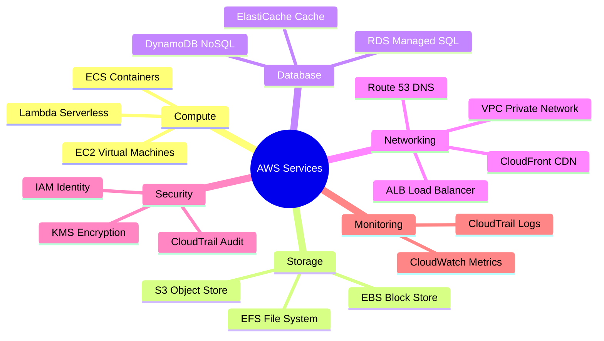

# P01 — Introduction to Cloud Platforms
**Track: Academic | Practical 1 of 10**

## Objective
Explore AWS console, identify compute/storage/networking services, use pricing calculator.

## Key Terms
| Term | Definition |
|------|-----------|
| AWS Console | Web GUI at console.aws.amazon.com |
| Free Tier | t2.micro 750hrs/month for 12 months |
| Region | Geographic area: ap-south-1 = Mumbai |
| Service | AWS product: EC2, S3, VPC, RDS, Lambda |

## AWS Service Map

## Steps
1. Login → console.aws.amazon.com → Set region to ap-south-1 (Mumbai)
2. Click Services → Browse categories above
3. Go to calculator.aws → Estimate t2.micro cost → Observe free tier = $0

## Viva Questions
1. **What is AWS Free Tier?** Certain services free for 12 months: t2.micro 750hrs, S3 5GB, Lambda 1M requests always free.
2. **Why does region matter?** Resources are region-specific. EC2 in Mumbai ≠ EC2 in North Virginia. Pricing varies by region.
3. **Name AWS compute services.** EC2, Lambda, ECS, EKS, Fargate, Elastic Beanstalk, Batch.
4. **GCP equivalent of EC2?** Google Compute Engine (GCE).
5. **Azure equivalent of S3?** Azure Blob Storage.
