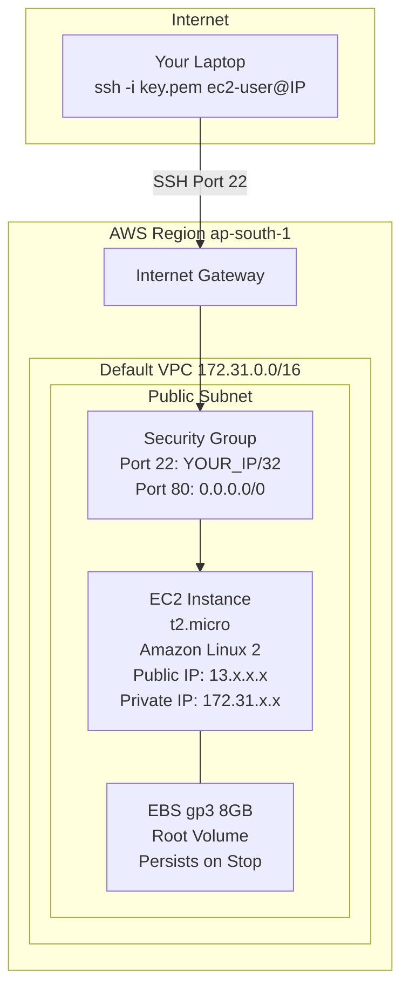
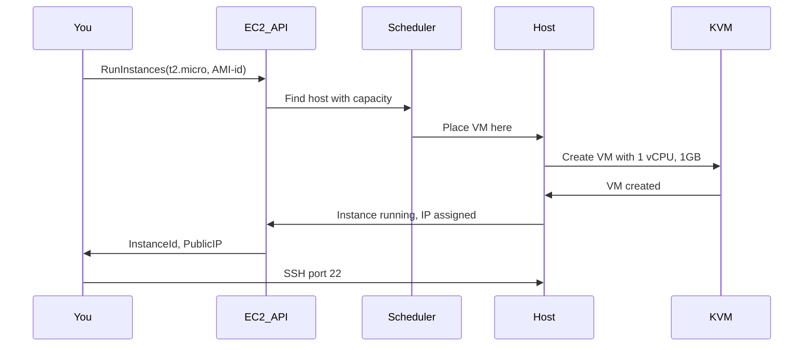

# P02 — Launch Your First EC2 Instance
**Track: Academic | Practical 2 of 10**

---

## Objective
Deploy a virtual machine on AWS EC2, configure security, and connect via SSH. Understand every term you encounter.

---

## Terms (Every Word Here Will Be Drilled)

| Term | Definition |
|------|-----------|
| **EC2** | Elastic Compute Cloud — AWS's IaaS VM service |
| **Instance** | A running virtual machine in EC2 |
| **AMI** | Amazon Machine Image — OS template for launching instances |
| **Instance Type** | Hardware profile: vCPUs + RAM + network. e.g., t2.micro |
| **vCPU** | Virtual CPU — one logical processor core |
| **Key Pair** | SSH auth: public key on AWS, private key (.pem) you hold |
| **Security Group** | Virtual firewall: stateful, instance-level, only allow rules |
| **Public IP** | Internet-facing IP, changes on stop/start |
| **Elastic IP** | Static public IP, persists across stop/start, free when in use |
| **SSH** | Secure Shell — encrypted remote terminal protocol, port 22 |
| **Inbound Rule** | Traffic permitted to enter the instance |
| **Outbound Rule** | Traffic permitted to leave the instance |
| **EBS Volume** | Virtual hard disk attached to instance |
| **User Data** | Bootstrap script runs once on first launch |
| **Stop** | Pause instance — EBS preserved, no compute charge |
| **Terminate** | Delete instance — root EBS deleted by default |
| **Instance Store** | Ephemeral storage — lost when instance stops |
| **Metadata Service** | 169.254.169.254 — instance queries its own config |
| **gp3** | General Purpose SSD v3 — default EBS type |
| **Free Tier** | t2.micro 750 hrs/month for 12 months |

---

## Architecture



---

## Step-by-Step

### Step 1: Launch Instance

1. Console → EC2 → **Launch instance**
2. Name: `my-ec2`
3. AMI: **Amazon Linux 2023** (Free tier eligible)
4. Instance type: **t2.micro** (1 vCPU, 1GB RAM)

**Instance type naming breakdown:**
```
t  2  . micro
│  │    └── Size (nano/micro/small/medium/large/xlarge)
│  └─────── Generation (higher = newer)
└────────── Family:
            t = burstable (uses CPU credits)
            m = general purpose (balanced)
            c = compute optimized
            r = memory optimized
            p = GPU
```

### Step 2: Key Pair

1. Click **Create new key pair**
2. Name: `my-key`
3. Type: RSA
4. Format: **.pem** (Linux/Mac) or .ppk (Windows PuTTY)
5. Download — **this is the only time you can download it**

### Step 3: Security Group

1. Network settings → Edit
2. Security group name: `my-sg`
3. **Change SSH source from 0.0.0.0/0 to "My IP"** — security requirement

| Rule | Type | Port | Source | Why |
|------|------|------|--------|-----|
| SSH | TCP | 22 | Your IP/32 | Remote access |
| HTTP | TCP | 80 | 0.0.0.0/0 | If hosting web server |

### Step 4: Launch and Connect

```bash
# Fix key permissions (required — SSH rejects world-readable keys)
chmod 400 ~/Downloads/my-key.pem

# Connect
ssh -i ~/Downloads/my-key.pem ec2-user@PUBLIC_IP
# Ubuntu AMI uses: ubuntu@PUBLIC_IP
# Amazon Linux uses: ec2-user@PUBLIC_IP

# Verify you're in
whoami                                              # ec2-user
uname -r                                           # kernel version
curl -s http://169.254.169.254/latest/meta-data/instance-id  # instance ID
```

### Step 5: Install Web Server (Prove It Works)

```bash
sudo yum update -y
sudo yum install httpd -y
sudo systemctl start httpd && sudo systemctl enable httpd
INSTANCE_ID=$(curl -s http://169.254.169.254/latest/meta-data/instance-id)
echo "<h1>Hello from $INSTANCE_ID</h1>" | sudo tee /var/www/html/index.html
```

Add HTTP inbound rule to security group. Visit `http://PUBLIC_IP` in browser.

---

## What Actually Happens at Launch (Flow)



---

## Common Errors

| Error | Cause | Fix |
|-------|-------|-----|
| `Permission denied (publickey)` | Wrong username or key | Amazon Linux = `ec2-user`, Ubuntu = `ubuntu` |
| `Connection timed out` | SG blocking port 22 | Add SSH inbound rule |
| `WARNING: UNPROTECTED PRIVATE KEY FILE` | Key too open | `chmod 400 key.pem` |
| `Host key verification failed` | Re-launched with same IP | `ssh-keygen -R YOUR_IP` |
| 502 on web server | Port 80 not in SG | Add HTTP inbound rule |

---

## Viva Questions — P02

1. **What is an AMI?** Template: OS + pre-installed software. AWS provides standard ones; you can create custom AMIs from running instances.
2. **Break down t2.micro.** t=burstable family, 2=second generation, micro=smallest size. 1 vCPU, 1GB RAM.
3. **Why chmod 400 the key?** SSH refuses to use private keys readable by group/others — security risk.
4. **Stop vs Terminate?** Stop = paused, EBS preserved, no compute charge. Terminate = deleted, root EBS gone.
5. **What is the metadata service at 169.254.169.254?** EC2 Instance Metadata Service (IMDS) — instance queries its own instance-id, type, region, IAM role credentials. Link-local address, unreachable from internet.
6. **Public IP vs Elastic IP?** Public IP changes on stop/start. Elastic IP is static, persists, free when attached to running instance.
7. **What is User Data?** Script runs ONCE on first launch. Used for installing software, configuring the instance.
8. **What is a Security Group? Is it stateful?** Virtual firewall at instance level. Stateful — return traffic automatically allowed without explicit outbound rule.
9. **If you allow inbound 80, do you need an outbound rule for the response?** No. Security Groups are stateful — response traffic automatically allowed.
10. **What happens to instance store data when you stop the instance?** Lost permanently. Instance store is ephemeral — physically on the host server. Use EBS for persistent data.
