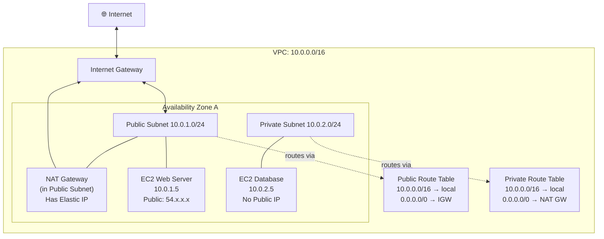
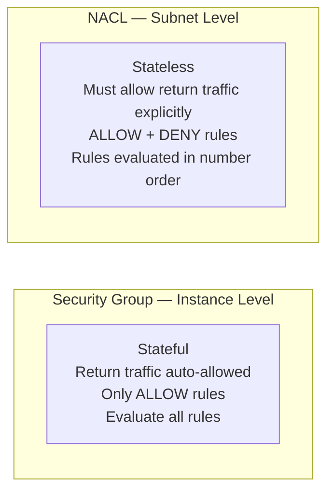

# P03 — Set Up a VPC
**Track: Academic | Practical 3 of 10**

---

## Objective
Create a custom VPC with public and private subnets, Internet Gateway, NAT Gateway, and route tables.

---

## Terms

| Term | Definition |
|------|-----------|
| **VPC** | Virtual Private Cloud — your logically isolated AWS network |
| **CIDR** | Classless Inter-Domain Routing: IP range notation e.g., 10.0.0.0/16 |
| **Subnet** | IP range subdivision, tied to one AZ |
| **Public Subnet** | Has route to IGW; instances can have public IPs |
| **Private Subnet** | No direct internet route; instances only have private IPs |
| **IGW** | Internet Gateway — bidirectional internet for public subnets |
| **NAT Gateway** | Outbound-only internet for private subnets |
| **Route Table** | Rules: destination CIDR → target |
| **Security Group** | Instance-level stateful firewall |
| **NACL** | Network ACL — subnet-level stateless firewall |
| **AZ** | Availability Zone — isolated data center within a region |

---

## Architecture

---

## CIDR Quick Reference

| Notation | IPs | Range | Usable (AWS -5) |
|----------|-----|-------|-----------------|
| /32 | 1 | Single host | 0 |
| /28 | 16 | .0–.15 | 11 |
| /24 | 256 | .0–.255 | 251 |
| /20 | 4,096 | | 4,091 |
| /16 | 65,536 | | 65,531 |

**AWS reserves 5 per subnet:** network address, VPC router, DNS, future use, broadcast.

---

## Step-by-Step

### Step 1: Create VPC
VPC → Create VPC → VPC only
- CIDR: `10.0.0.0/16`
- Name: `my-vpc`

### Step 2: Create Subnets
Create two subnets:
- `public-subnet`: 10.0.1.0/24, AZ: ap-south-1a
- `private-subnet`: 10.0.2.0/24, AZ: ap-south-1a

### Step 3: Create and Attach Internet Gateway
VPC → Internet Gateways → Create → Attach to `my-vpc`
**Rule: Only ONE IGW per VPC.**

### Step 4: Create Route Tables

**Public RT:**
- Create → Associate `public-subnet`
- Edit Routes → Add: `0.0.0.0/0` → Target: IGW

**Private RT:**
- Create → Associate `private-subnet`
- (Add NAT GW route after Step 5)

### Step 5: Create NAT Gateway
VPC → NAT Gateways → Create
- Subnet: **public-subnet** (NAT GW must be in public subnet)
- Elastic IP: Allocate new

After creation (~2 min): Update private-RT → Add `0.0.0.0/0` → NAT GW

### Step 6: Launch Instances to Verify
- Web server: public-subnet, auto-assign public IP enabled
- DB server: private-subnet, NO public IP

---

## Security Group vs NACL

---

## Viva Questions — P03

1. **Why does NAT GW need to be in a public subnet?** NAT GW needs internet access to forward private subnet traffic. It gets this via the public subnet's IGW route. In private subnet, it couldn't reach internet.
2. **Trace the path when a private EC2 calls api.google.com.** Private EC2 → private RT: 0.0.0.0/0 → NAT GW → NAT GW (in public subnet) → public RT: 0.0.0.0/0 → IGW → Internet → Google.
3. **Difference between Security Group and NACL?** SG = instance-level, stateful, only allow. NACL = subnet-level, stateless, allow and deny.
4. **What does stateful mean?** If inbound port 80 allowed, response traffic automatically allowed outbound. Firewall tracks connection state.
5. **Can two VPCs communicate?** Not by default. Requires VPC Peering (non-transitive, point-to-point) or Transit Gateway (hub-spoke).
6. **Why 10.0.0.0/16 for VPC?** It's an RFC 1918 private range. /16 gives 65,536 addresses — enough for many subnets.
7. **AWS reserves 5 IPs per subnet. Which ones?** First (.0 network), second (.1 VPC router), third (.2 DNS), fourth (.3 future), last (.255 broadcast).
8. **One IGW per VPC — why?** IGW is an AWS-managed HA component. It's already redundant internally. Multiple IGWs would create routing ambiguity.
