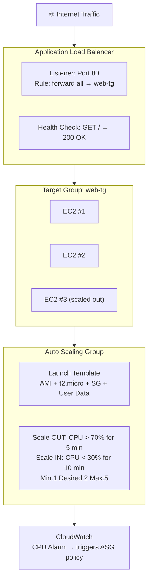

# P04 — Auto Scaling and Load Balancing
**Track: Academic | Practical 4 of 10**

## Objective
Create Auto Scaling Group with Launch Template and Application Load Balancer.

## Terms
| Term | Definition |
|------|-----------|
| **ASG** | Auto Scaling Group — auto-manages EC2 fleet size |
| **Launch Template** | Blueprint: AMI + instance type + SG + key + user data |
| **Target Tracking** | Keep metric at target value by scaling |
| **ALB** | Application Load Balancer — Layer-7 HTTP routing |
| **Target Group** | EC2 instances receiving ALB traffic |
| **Health Check** | ALB pings instances; unhealthy = removed |
| **Listener** | ALB port watching for connections (e.g., 443) |
| **Desired/Min/Max** | Desired = target count; never below min, never above max |
| **Cooldown** | Wait time after scaling before evaluating again |
| **Round Robin** | Default: distribute requests evenly across targets |

## Architecture



## Steps

### 1. Create Launch Template
EC2 → Launch Templates → Create
- AMI: Amazon Linux 2, t2.micro
- User Data:
```bash
#!/bin/bash
yum install -y httpd
systemctl start httpd && systemctl enable httpd
INSTANCE_ID=$(curl -s 169.254.169.254/latest/meta-data/instance-id)
echo "<h1>Served by: $INSTANCE_ID</h1>" > /var/www/html/index.html
```

### 2. Create ALB
EC2 → Load Balancers → Create → Application
- Scheme: Internet-facing
- AZs: Select 2 public subnets (ALB needs 2 AZs minimum)
- Target Group: Create new, HTTP/80, health check: GET /

### 3. Create ASG
EC2 → Auto Scaling Groups → Create
- Launch Template: your template
- VPC: your VPC, subnets: both
- Attach to ALB target group
- Health check: ELB (uses ALB health checks)
- Min:1, Desired:2, Max:5
- Policy: Target tracking, CPU = 70%

### 4. Test
1. Get ALB DNS name → open in browser → see instance ID
2. Refresh multiple times → different instance IDs = load balancing confirmed
3. SSH to instance → `stress --cpu $(nproc) --timeout 600` → watch ASG launch new instances

## Viva Questions
1. **Vertical vs horizontal scaling?** Vertical = bigger instance (limited by hardware max). Horizontal = more instances (unlimited). ASG = horizontal.
2. **Why 2 AZs minimum for ALB?** High availability — single AZ = single point of failure. ALB routes around unhealthy AZ.
3. **What is cooldown period?** Prevents scaling thrashing. After a scale action, ASG waits before evaluating policies again.
4. **What happens when instance fails health check?** ALB stops routing to it. ASG terminates it and launches replacement.
5. **ALB vs Classic LB?** ALB = Layer 7 (HTTP), path/host routing, WebSocket. Classic = Layer 4/7, less intelligent. AWS recommends ALB.