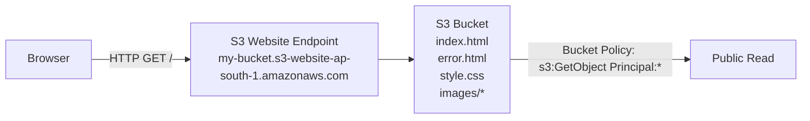

# P05 — Static Website on S3
**Track: Academic | Practical 5 of 10**

## Objective
Host a static HTML/CSS website directly on S3.

## Terms
| Term | Definition |
|------|-----------|
| **Bucket** | Container for S3 objects, globally unique name |
| **Object** | File stored in S3: key + data + metadata |
| **Key** | Object identifier = full path (e.g., images/logo.png) |
| **Bucket Policy** | JSON document: who can do what to bucket |
| **Block Public Access** | Account-level safeguard against accidental public exposure |
| **Index Document** | Default file on root request: index.html |
| **Error Document** | Shown on 404: error.html |
| **Website Endpoint** | Special HTTP URL for static hosting (not the object URL) |
| **Durability** | 99.999999999% (11 nines) — 3+ AZ redundancy |
| **Versioning** | Keep multiple versions of objects |

## Architecture



## Steps
1. S3 → Create Bucket → unique name → **uncheck Block Public Access**
2. Upload index.html and error.html
3. Properties → Static website hosting → Enable → index.html + error.html
4. Permissions → Bucket Policy:
```json
{
  "Version": "2012-10-17",
  "Statement": [{
    "Effect": "Allow",
    "Principal": "*",
    "Action": "s3:GetObject",
    "Resource": "arn:aws:s3:::YOUR-BUCKET-NAME/*"
  }]
}
```
5. Test: bucket website endpoint URL in browser

## Viva Questions
1. **Object URL vs website endpoint?** Object URL = HTTPS direct link, requires bucket policy. Website endpoint = HTTP only, serves index/error docs.
2. **Why can't you run Python/PHP on S3?** S3 serves files, doesn't execute code. Object storage ≠ web server.
3. **What is Block Public Access?** Default safeguard preventing accidental public exposure. Must explicitly disable before public bucket policy works.
4. **What is an ARN?** Amazon Resource Name — unique identifier. `arn:aws:s3:::bucket/*` = all objects in bucket.
5. **S3 vs EBS?** S3 = HTTP object access, unlimited, not mountable. EBS = block storage mounted as drive on EC2.