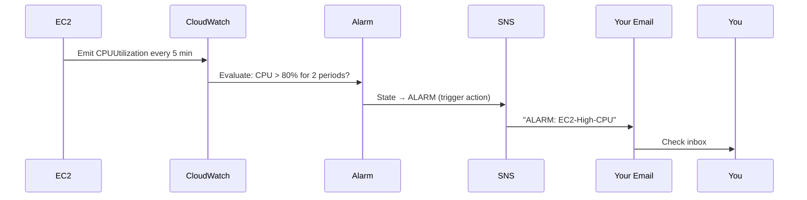

# P06 — CloudWatch Monitoring
**Track: Academic | Practical 6 of 10**

## Objective
Set up CloudWatch metrics, alarm, SNS email notification. Trigger alarm with CPU stress.

## Terms
| Term | Definition |
|------|-----------|
| **Metric** | Time-series data point: CPUUtilization = 45% |
| **Namespace** | Metric category: AWS/EC2, AWS/RDS |
| **Alarm** | Watches metric; transitions OK/ALARM/INSUFFICIENT_DATA |
| **Period** | Evaluation interval: 60s or 5min |
| **Evaluation Periods** | How many consecutive breaches before alarm fires |
| **SNS Topic** | Pub/sub channel for notifications |
| **Subscription** | Subscriber endpoint: email, SMS, Lambda |
| **Dashboard** | Custom metric visualization page |
| **CloudWatch Agent** | Software on EC2 to send OS-level metrics (RAM, disk) |
| **Statistic** | Aggregation: Average, Sum, Maximum, p99 |

## Architecture



## Steps

### 1. Create SNS Topic
SNS → Topics → Create Standard → Name: `ec2-alerts`
→ Create Subscription → Protocol: Email → your@email.com
→ Confirm subscription link in email (**must do this**)

### 2. Create CloudWatch Alarm
CloudWatch → Alarms → Create → Select Metric
→ EC2 → Per-Instance → CPUUtilization → your instance
→ Threshold: Greater than 80
→ Period: 5 minutes, Evaluation Periods: 2
→ Action: In alarm → send to `ec2-alerts` SNS
→ Name: `High-CPU`

### 3. Simulate High CPU
```bash
sudo yum install stress -y
stress --cpu $(nproc) --timeout 600
# Watch CloudWatch graph spike
# After 10 minutes (2 × 5min): alarm fires → email arrives
```

## Viva Questions
1. **3 CloudWatch alarm states?** OK (normal), ALARM (threshold breached), INSUFFICIENT_DATA (not enough data).
2. **Why 2 evaluation periods not 1?** Single spike may be transient. 2 consecutive confirms sustained load. Prevents false alarms.
3. **Why doesn't CloudWatch collect RAM by default?** RAM is inside the OS — AWS can only see hypervisor-level metrics (CPU, network, disk I/O from outside the VM). CloudWatch Agent runs inside to report OS metrics.
4. **SNS vs SES?** SNS = system notifications (pub/sub, CloudWatch alarms). SES = transactional email from apps (receipts, newsletters).
5. **What is detailed monitoring?** 1-minute granularity instead of default 5-minute. Costs $0.30/metric/month.
