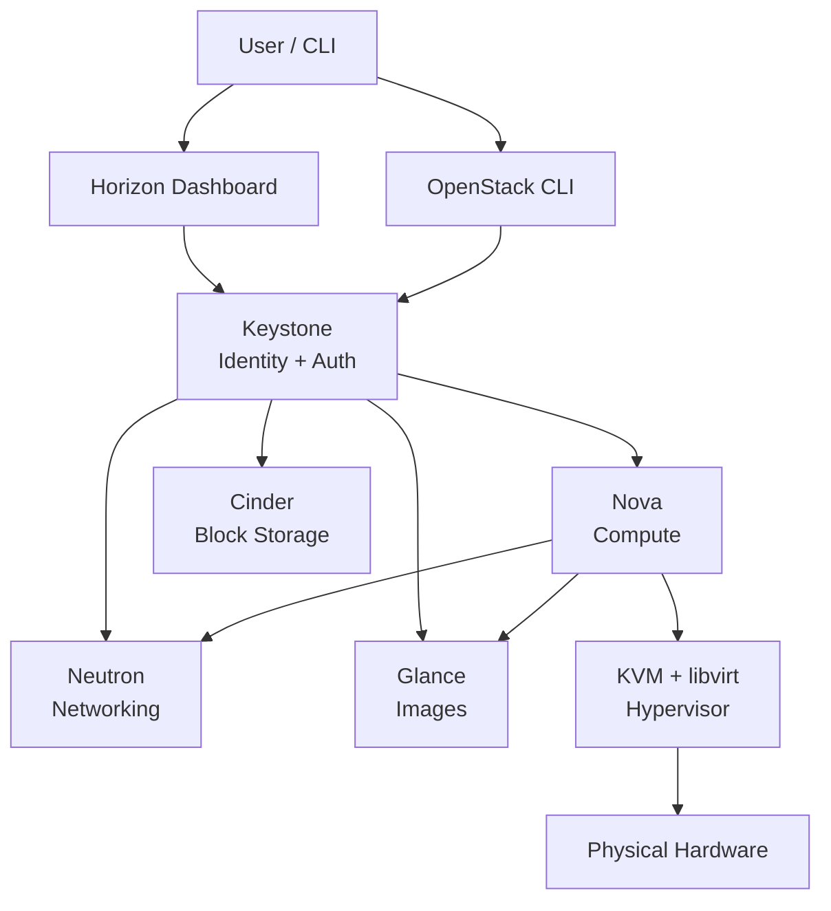

# P07 — Install OpenStack (DevStack)
**Track: Academic | Practical 7 of 10**

## Objective
Set up a local OpenStack environment using DevStack for private cloud practice.

## Terms
| Term | Definition |
|------|-----------|
| **OpenStack** | Open-source private cloud platform |
| **DevStack** | Single-script OpenStack for dev/testing |
| **Nova** | Compute service — manages VM lifecycle |
| **Neutron** | Networking service — virtual networks |
| **Glance** | Image service — stores VM images |
| **Keystone** | Identity service — authentication + authorization |
| **Horizon** | Web dashboard (like AWS console) |
| **Cinder** | Block storage service (like EBS) |
| **Swift** | Object storage (like S3) |
| **KVM** | Hypervisor used by Nova |
| **QCOW2** | VM image format (copy-on-write) |
| **Token** | Keystone temporary credential |

## OpenStack Service Map



## Steps

```bash
# Ubuntu 22.04 required. Minimum: 4GB RAM, 20GB disk.
sudo useradd -s /bin/bash -d /opt/stack -m stack
echo "stack ALL=(ALL) NOPASSWD: ALL" | sudo tee /etc/sudoers.d/stack
sudo su - stack

git clone https://opendev.org/openstack/devstack && cd devstack

cat > local.conf << 'EOF'
[[local|localrc]]
ADMIN_PASSWORD=secret123
DATABASE_PASSWORD=secret123
RABBIT_PASSWORD=secret123
SERVICE_PASSWORD=secret123
disable_service tempest
enable_service horizon
LOGFILE=/opt/stack/logs/stack.log
EOF

./stack.sh  # Takes 20-40 minutes

source openrc admin admin
openstack service list  # Verify all services up
```

Access Horizon: `http://YOUR_IP/dashboard` | user: admin | pass: secret123

## Viva Questions
1. **OpenStack vs AWS?** OpenStack = open-source, runs on YOUR hardware, private cloud. AWS = commercial, provider's hardware, public cloud.
2. **AWS equivalent of Nova, Glance, Neutron, Keystone?** Nova=EC2, Glance=AMI registry, Neutron=VPC, Keystone=IAM.
3. **What is DevStack?** Dev/test deployment script. NOT for production — no HA, no proper security.
4. **What is a QCOW2 image?** QEMU Copy-on-Write v2 format. Base image read-only; each VM gets a write layer on top. Multiple VMs share one base image.
5. **What is nested virtualization?** Running a hypervisor inside a VM. Required when using DevStack on AWS EC2.