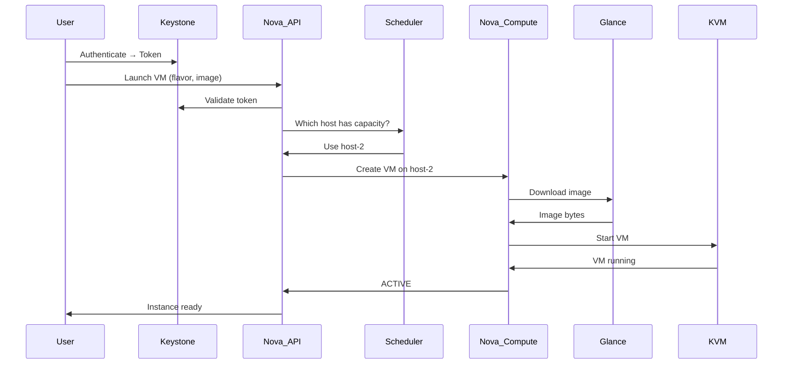

# P08 — Launch OpenStack VM
**Track: Academic | Practical 8 of 10**

## Objective
Create project, upload image to Glance, define flavor, launch VM instance.

## Key Flow



## Steps

```bash
source /opt/stack/devstack/openrc admin admin

# Create project and user
openstack project create myproject
openstack user create --password mypass myuser
openstack role add --project myproject --user myuser member

# Upload Ubuntu image
wget https://cloud-images.ubuntu.com/jammy/current/jammy-server-cloudimg-amd64.img
openstack image create "Ubuntu-22.04" \
  --file jammy-server-cloudimg-amd64.img \
  --disk-format qcow2 --container-format bare --public

# Create flavor (VM hardware profile)
openstack flavor create --vcpus 1 --ram 512 --disk 5 m1.tiny

# Create key pair and security group
openstack keypair create mykey > mykey.pem && chmod 400 mykey.pem
openstack security group create web-sg
openstack security group rule create web-sg --protocol tcp --dst-port 22 --remote-ip 0.0.0.0/0
openstack security group rule create web-sg --protocol tcp --dst-port 80 --remote-ip 0.0.0.0/0

# Launch instance
openstack server create \
  --flavor m1.tiny --image "Ubuntu-22.04" \
  --key-name mykey --security-group web-sg \
  --network private my-vm

openstack server show my-vm  # Wait for ACTIVE
```

## Viva Questions
1. **What is a flavor? AWS equivalent?** Pre-defined VM hardware spec (vCPUs, RAM, disk). AWS equivalent = instance type (t2.micro).
2. **What does Nova-Scheduler do?** Filters compute nodes by available RAM/CPU/disk/affinity rules, selects best host for new VM.
3. **What is QCOW2 copy-on-write?** Base image read-only. Each VM writes to its own delta layer. Multiple VMs share base image = storage efficient.
4. **How does Glance relate to Nova?** When Nova launches a VM, it requests the boot image from Glance. Glance streams it to the compute node.