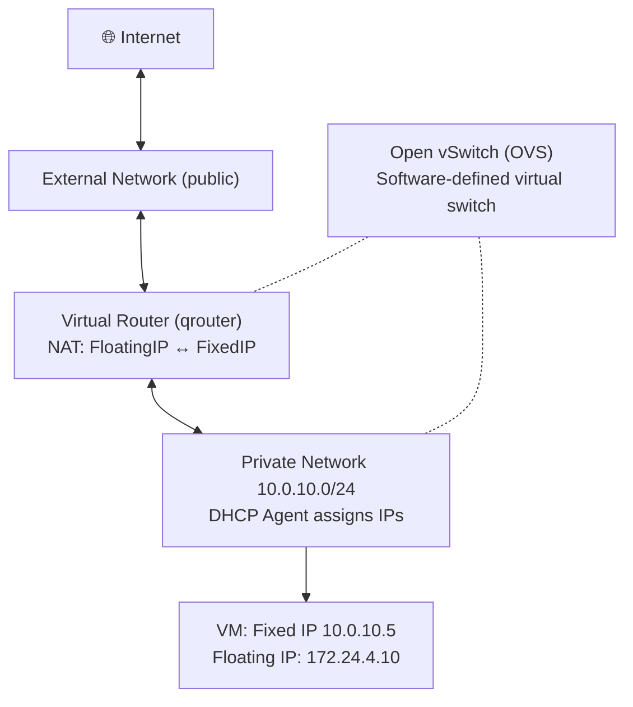

# P09 — OpenStack Networking (Neutron)
**Track: Academic | Practical 9 of 10**

## Objective
Create private/public networks, router, assign floating IPs.

## Architecture



## Steps

```bash
source /opt/stack/devstack/openrc myuser myproject

# Create private network
openstack network create private-net
openstack subnet create private-subnet \
  --network private-net --subnet-range 10.0.10.0/24 --dns-nameserver 8.8.8.8

# Create router and connect to external
openstack router create my-router
openstack router set my-router --external-gateway public
openstack router add subnet my-router private-subnet

# Launch VM in private network
openstack server create \
  --flavor m1.tiny --image "Ubuntu-22.04" \
  --key-name mykey --security-group web-sg \
  --network private-net networked-vm

# Assign floating IP
openstack floating ip create public
openstack server add floating ip networked-vm FLOATING_IP

# SSH in
ssh -i mykey.pem ubuntu@FLOATING_IP
```

## Viva Questions
1. **Fixed IP vs floating IP?** Fixed = private, permanent, from subnet DHCP. Floating = public, associated/disassociated on demand (like AWS Elastic IP).
2. **What is Open vSwitch?** Software-defined virtual switch. Neutron uses it to connect VMs, implement VXLAN tunnels, apply routing rules.
3. **Why does router need two interfaces?** One leg on external network (public), one on private network (VM gateway). Routes and NATs between them.
4. **What is a DHCP Agent?** Neutron runs dnsmasq for each tenant subnet. Assigns fixed IPs to VMs on boot.