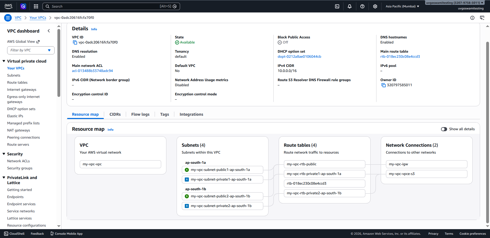
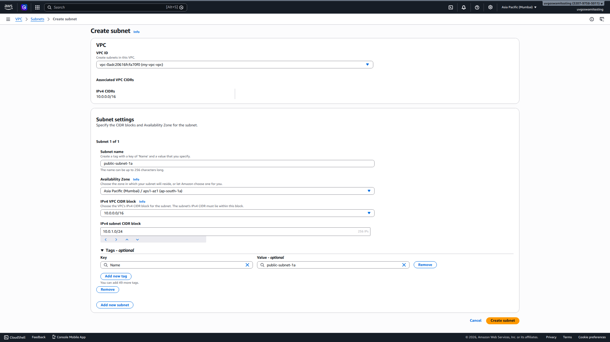

# Practical 3 — Set Up a VPC (Virtual Private Cloud)
**Objective:** Create a custom VPC with public and private subnets, configure routing and internet access.

---

## All Terms You Will Encounter

| Term | Definition |
|------|-----------|
| **VPC** | Virtual Private Cloud — your logically isolated network in AWS |
| **CIDR Block** | IP address range in notation like 10.0.0.0/16 |
| **Subnet** | Subdivision of VPC IP range, tied to one Availability Zone |
| **Public Subnet** | Subnet with route to Internet Gateway; instances can have public IPs |
| **Private Subnet** | Subnet without direct internet route; instances have only private IPs |
| **Internet Gateway (IGW)** | Component that enables internet communication for VPC |
| **NAT Gateway** | Allows private subnet instances to reach internet (outbound only) |
| **Route Table** | Set of rules controlling where network traffic is directed |
| **Security Group** | Instance-level virtual firewall (stateful) |
| **NACL** | Network Access Control List — subnet-level firewall (stateless) |
| **AZ** | Availability Zone — isolated data center within a region |
| **Default VPC** | VPC AWS creates automatically in each region for your account |
| **VPC Peering** | Connection between two VPCs to allow private communication |
| **Elastic Network Interface (ENI)** | Virtual network card attached to EC2 instance |

---

## VPC Architecture — Full Diagram

```
┌──────────────────────────────────────────────────────────────────────┐
│                   VPC: 10.0.0.0/16 (my-vpc)                        │
│                   Region: ap-south-1 (Mumbai)                        │
│                                                                      │
│  ┌────────────────────────────────────────────────────────────────┐  │
│  │  Availability Zone: ap-south-1a                                │  │
│  │                                                                │  │
│  │  ┌──────────────────────────┐  ┌──────────────────────────┐   │  │
│  │  │  Public Subnet           │  │  Private Subnet          │   │  │
│  │  │  10.0.1.0/24             │  │  10.0.2.0/24             │   │  │
│  │  │                          │  │                          │   │  │
│  │  │  ┌────────────────────┐  │  │  ┌────────────────────┐  │   │  │
│  │  │  │  EC2 Web Server    │  │  │  │  EC2 Database      │  │   │  │
│  │  │  │  Private: 10.0.1.5 │  │  │  │  Private: 10.0.2.5 │  │   │  │
│  │  │  │  Public: 54.x.x.x  │  │  │  │  No Public IP      │  │   │  │
│  │  │  └────────────────────┘  │  │  └─────────┬──────────┘  │   │  │
│  │  └─────────────┬────────────┘  └────────────│─────────────┘   │  │
│  └───────────────┼────────────────────────────┼─────────────────┘  │
│                  │                            │                     │
│     Route Table (public):         Route Table (private):           │
│     10.0.0.0/16 → local           10.0.0.0/16 → local              │
│     0.0.0.0/0  → IGW              0.0.0.0/0  → NAT GW             │
│                  │                            │                     │
│  ┌───────────────▼────────────┐    ┌──────────▼──────────────┐    │
│  │  Internet Gateway (IGW)   │    │  NAT Gateway            │    │
│  │  my-igw                   │    │  (in public subnet)      │    │
│  └───────────────┬────────────┘    │  Has Elastic IP         │    │
│                  │                 └─────────────────────────┘    │
│  ┌───────────────▼────────────┐                                    │
│  │         INTERNET           │                                    │
│  └────────────────────────────┘                                    │
└──────────────────────────────────────────────────────────────────────┘
```

---

## Step-by-Step: Create Custom VPC

### Step 1: Create VPC
1. AWS Console → VPC → Your VPCs → **Create VPC**
2. Name tag: `my-custom-vpc`
3. IPv4 CIDR block: `10.0.0.0/16`
4. Tenancy: Default (shared hardware)
5. Click **Create VPC**


**Why 10.0.0.0/16?** This is a private IP range (RFC 1918). /16 gives 65,536 addresses — plenty for practice.

### Step 2: Create Subnets
**Public Subnet:**
1. VPC → Subnets → Create Subnet
2. VPC: Select `my-custom-vpc`
3. Subnet name: `public-subnet-1a`
4. AZ: `ap-south-1a`
5. IPv4 CIDR: `10.0.1.0/24` (256 addresses)
6. Create


**Private Subnet:**
1. Create Subnet again
2. Name: `private-subnet-1a`
3. AZ: `ap-south-1a`
4. IPv4 CIDR: `10.0.2.0/24`
5. Create

### Step 3: Create and Attach Internet Gateway
1. VPC → Internet Gateways → **Create Internet Gateway**
2. Name: `my-igw`
3. Create, then: Actions → **Attach to VPC** → Select `my-custom-vpc`

**Key fact:** Only ONE IGW per VPC.

### Step 4: Create Route Tables

**Public Route Table:**
1. VPC → Route Tables → Create Route Table
2. Name: `public-rt`
3. VPC: `my-custom-vpc`
4. Create
5. Edit Routes → Add Route: `0.0.0.0/0` Target: `my-igw`
6. Subnet Associations → Associate `public-subnet-1a`

**Private Route Table:**
1. Create Route Table: `private-rt`
2. Associate `private-subnet-1a`
3. (Will add NAT GW route after creating it)

### Step 5: Create NAT Gateway
1. VPC → NAT Gateways → **Create NAT Gateway**
2. Name: `my-nat-gw`
3. Subnet: **`public-subnet-1a`** ← NAT GW MUST be in PUBLIC subnet
4. Elastic IP: Click "Allocate Elastic IP"
5. Create

Wait ~2 minutes for state: Available.

6. Return to `private-rt` → Edit Routes → Add: `0.0.0.0/0` → Target: `my-nat-gw`

### Step 6: Launch Instances to Test

**Web Server in Public Subnet:**
- Launch EC2 → Select `my-custom-vpc`, `public-subnet-1a`
- Enable "Auto-assign public IP"
- Security Group: Allow SSH (22) and HTTP (80)

**Database in Private Subnet:**
- Launch EC2 → Select `my-custom-vpc`, `private-subnet-1a`
- Do NOT auto-assign public IP
- Security Group: Allow SSH (22) from web server's private IP only

---

## CIDR Calculation Quick Reference

```
┌──────────────────────────────────────────────────────────────────┐
│                    CIDR CHEAT SHEET                              │
│                                                                  │
│  /32 = 1 IP (single host)                                       │
│  /28 = 16 IPs                                                   │
│  /24 = 256 IPs (one "class C" subnet)                          │
│  /20 = 4,096 IPs                                                │
│  /16 = 65,536 IPs (common for VPC)                             │
│                                                                  │
│  For subnets within 10.0.0.0/16:                               │
│  10.0.1.0/24 = 256 IPs (10.0.1.0 → 10.0.1.255)               │
│  10.0.2.0/24 = 256 IPs (10.0.2.0 → 10.0.2.255)               │
│  AWS reserves 5 IPs per subnet (first 4 + last 1)              │
│  So /24 gives you 251 usable IPs                               │
└──────────────────────────────────────────────────────────────────┘
```

---

## Common Errors and Fixes

| Error | Cause | Fix |
|-------|-------|-----|
| Instance in public subnet has no internet | Missing IGW route or no public IP | Check route table has 0.0.0.0/0 → IGW; enable auto-assign public IP |
| Private instance cannot reach internet | Missing NAT GW route | Add 0.0.0.0/0 → NAT GW to private route table |
| Cannot SSH to private instance | No public IP | SSH into public instance first (bastion), then SSH from there to private |
| NAT Gateway stuck "Pending" | Takes 2-3 minutes | Wait and refresh |

---

## Viva Questions — Practical 3

1. **What is a VPC? Why do you need to create your own instead of using the default?**  
   A: Virtual Private Cloud — your isolated network in AWS. Default VPC is fine for learning but has all public subnets, less control. Custom VPC lets you define subnet structure, routing, security zones properly.

2. **Why does the NAT Gateway need to be in the public subnet?**  
   A: NAT GW needs internet access to forward traffic for private instances. It gets this via the public subnet's route to IGW. If NAT GW were in private subnet, it couldn't reach the internet.

3. **If a private subnet instance tries to call api.google.com, trace the path.**  
   A: Instance → Private subnet → Route table: 0.0.0.0/0 → NAT GW → NAT GW (in public subnet) → Route table: 0.0.0.0/0 → IGW → Internet → Google.

4. **What is the difference between a Security Group and a NACL?**  
   A: SG = instance level, stateful (return traffic auto-allowed), only allow rules. NACL = subnet level, stateless (must explicitly allow return traffic), allow AND deny rules. NACLs evaluated in numbered order.

5. **What does stateful mean in the context of Security Groups?**  
   A: If you allow inbound Port 80 from an IP, the return traffic (response) is automatically allowed outbound even without an explicit outbound rule. The firewall tracks the connection state.

6. **AWS reserves 5 IPs in each subnet. Which ones and why?**  
   A: First IP (network address), Second (VPC router), Third (reserved by AWS for future), Fourth (broadcast — not used in AWS VPC but reserved), Last IP (broadcast address). So /24 gives 256 - 5 = 251 usable IPs.

7. **Can two VPCs communicate with each other?**  
   A: Not by default. Require VPC Peering (point-to-point, non-transitive) or Transit Gateway (hub-and-spoke, connects many VPCs).

8. **What is the difference between Public IP and Elastic IP?**  
   A: Public IP assigned automatically, changes when instance stops/starts. Elastic IP is static, allocated to your account, persists across stop/start. Free when attached to running instance; charged when idle.

---
