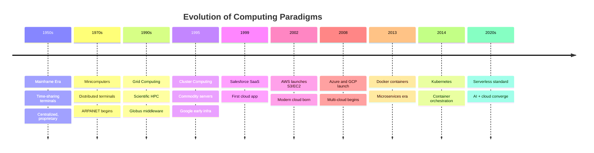
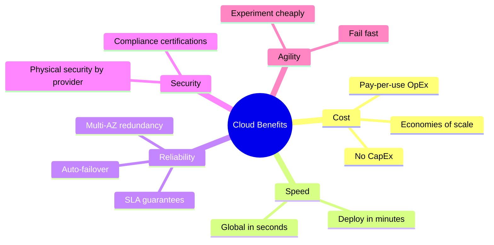

# A01 — Cloud Computing Fundamentals
**Track: Academic | Exam Weight: Unit 1 (~6 hrs)**

---

## 1. NIST Definition (Memorize Word-for-Word)

> *"Cloud computing is a model for enabling ubiquitous, convenient, on-demand network access to a shared pool of configurable computing resources that can be rapidly provisioned and released with minimal management effort or service provider interaction."*
> — NIST SP 800-145

### 5 Essential Characteristics

| # | Characteristic | What It Means | Exam Trap |
|---|---------------|--------------|-----------|
| 1 | On-demand self-service | Provision without human interaction | "Self" = no support ticket needed |
| 2 | Broad network access | Any device, any standard network | Phone, tablet, laptop — all count |
| 3 | Resource pooling | Multi-tenant, location-independent | You don't know which server you're on |
| 4 | Rapid elasticity | Scale up/down automatically | Appears unlimited to the user |
| 5 | Measured service | Pay per use, monitored | Utility billing model |

**Elasticity vs Scalability trap:** Elasticity = bidirectional automatic (up AND down). Scalability = ability to grow. Elasticity implies automation; scalability does not.

---

## 2. History Timeline

### Paradigm Comparison Table

| Paradigm | Coupling | Location | Billing | Self-Service | Scale |
|----------|---------|----------|---------|-------------|-------|
| Mainframe | Tight | Central | Fixed | No | No |
| Grid | Loose | Distributed | Free/Academic | No | Manual |
| Cluster | Tight | Co-located | Fixed | No | Manual |
| Distributed | Loose | Anywhere | Varies | No | Manual |
| Cloud | Loose | Anywhere | Pay-per-use | Yes | Automatic |

---

## 3. Benefits and Limitations

### Benefits

### Limitations (Examiner Loves These)

| Limitation | Technical Reason | Real Example |
|------------|-----------------|-------------|
| Internet dependency | No WAN = no cloud | AWS 2021 outage — Netflix/Reddit down |
| Vendor lock-in | Provider-specific APIs | Lambda code ≠ Azure Functions |
| Data sovereignty | Data crosses borders | GDPR issues with US-stored EU data |
| Latency | Network adds RTT | HFT cannot use shared cloud for execution |
| Egress costs | Data-out is charged | Surprise $10,000 AWS bill from data transfer |
| Noisy neighbor | Shared physical hardware | VM co-tenant using 90% disk I/O |

---

## 4. Service-Oriented vs Utility-Oriented Computing

**SOC (Service-Oriented Computing):** Design paradigm — software as self-describing, loosely coupled services communicating over standard protocols (REST/SOAP). About *architecture*.

**Utility Computing:** Billing model — resources metered like electricity, pay per unit consumed. About *pricing*.

Cloud = SOC + Utility. Services delivered (SOC) on a metered basis (Utility).

---

## 5. Cloud Platforms Comparison

| Service | AWS | Azure | GCP |
|---------|-----|-------|-----|
| VMs | EC2 | Virtual Machines | Compute Engine |
| Object Storage | S3 | Blob Storage | Cloud Storage |
| Managed SQL | RDS | Azure SQL | Cloud SQL |
| Serverless | Lambda | Functions | Cloud Functions |
| Container Orch | EKS | AKS | GKE |
| Identity | IAM | Azure AD | Cloud IAM |
| Monitoring | CloudWatch | Azure Monitor | Cloud Monitoring |
| Data Warehouse | Redshift | Synapse | BigQuery |
| CDN | CloudFront | Azure CDN | Cloud CDN |
| DNS | Route 53 | Azure DNS | Cloud DNS |

---

## 6. Viva Questions — Unit 1

**Q: Give the NIST definition of cloud computing.**  
A: [Quote NIST SP 800-145 verbatim as above]

**Q: What makes cloud different from grid computing?**  
A: Grid = federated, scientific, no billing, no self-service, heterogeneous. Cloud = provider-owned, commercial, pay-per-use, self-service, homogeneous.

**Q: Is cloud computing just mainframe computing reborn?**  
A: Conceptually similar (centralized compute, shared resources) but fundamentally different. Mainframe = proprietary hardware, no internet access, single organization. Cloud = commodity hardware, internet-accessible, multi-tenant across organizations, automated self-service.

**Q: Difference between elasticity and scalability?**  
A: Scalability = can handle growth (directional, may be manual). Elasticity = auto-bidirectional scaling based on demand (up AND down, automated).

**Q: What is vendor lock-in? Give a concrete example.**  
A: Dependency on provider-specific technology making migration costly. Example: AWS Lambda uses IAM event triggers, AWS-specific SDK patterns, and CloudWatch integration. Migrating to Azure Functions requires rewriting trigger logic, re-implementing auth, and switching monitoring — not a copy-paste.
