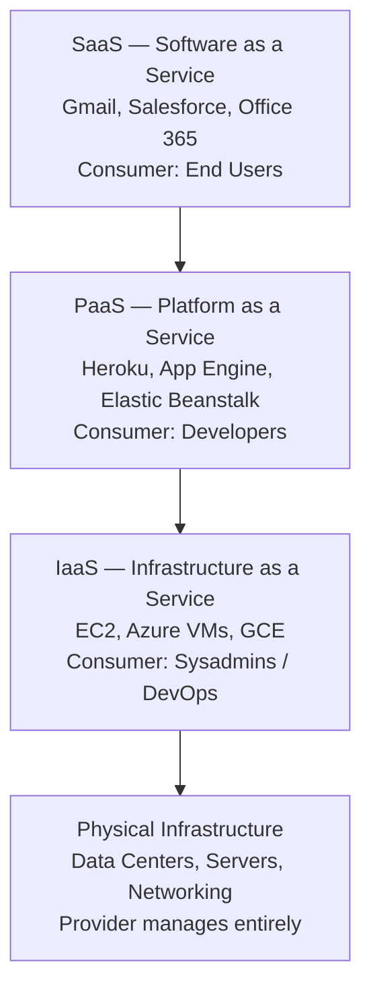
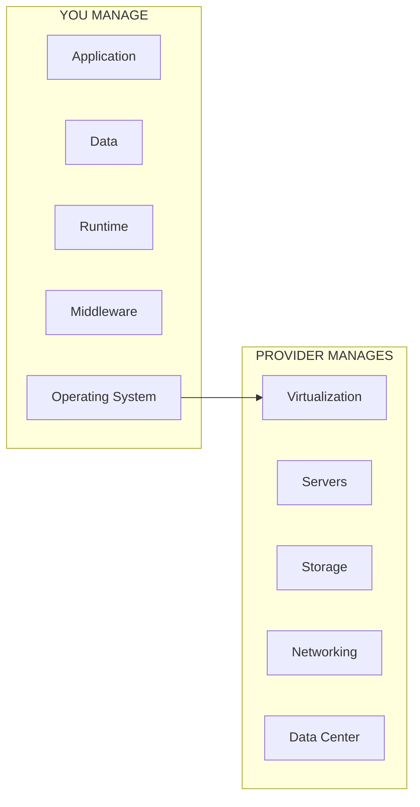
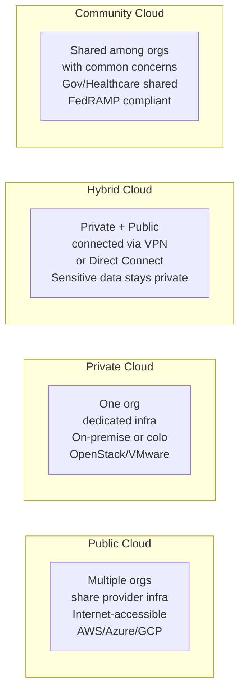
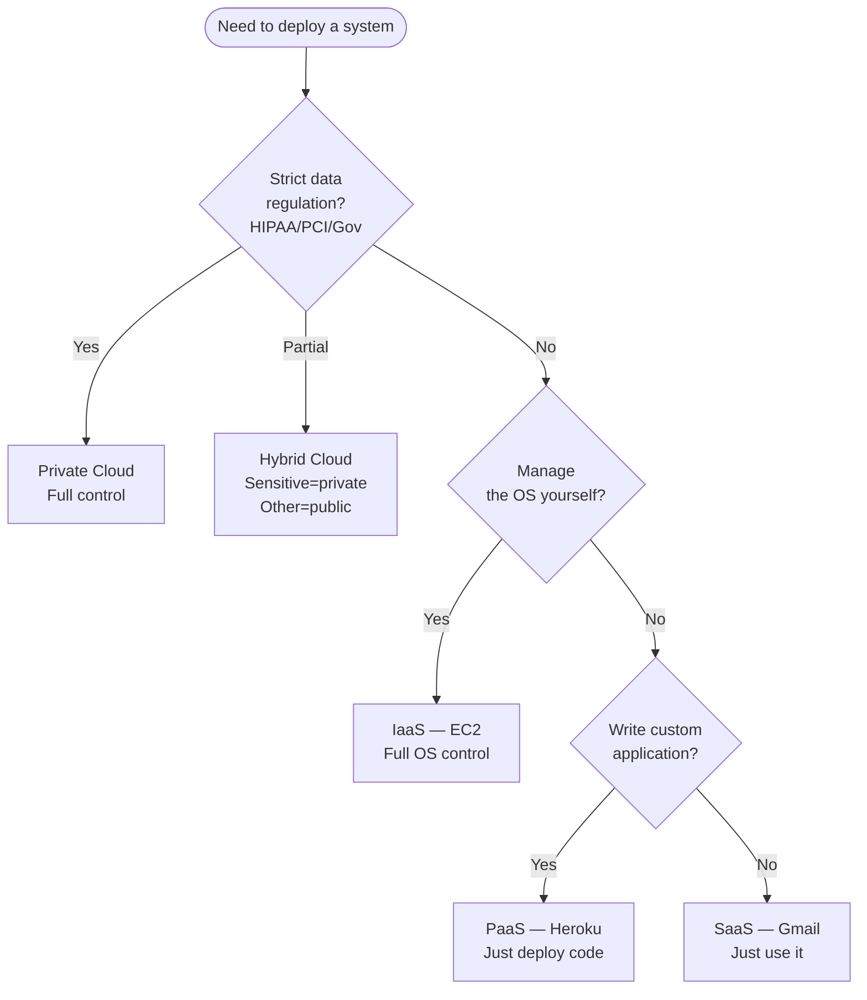

# A02 — Cloud Architecture & Service Models
**Track: Academic | Exam Weight: Unit 4 (~6 hrs) | CRITICAL UNIT**

---

## 1. Cloud Reference Model

---

## 2. IaaS — Infrastructure as a Service

**Definition:** Provider delivers virtualized computing resources (VMs, storage, networking) over the internet. Consumer manages OS upward.

### Shared Responsibility in IaaS

**IaaS examples:**

| Provider | Compute | Block Storage | Object Storage | Network |
|----------|---------|--------------|----------------|---------|
| AWS | EC2 | EBS | S3 | VPC |
| Azure | Virtual Machines | Managed Disks | Blob | VNet |
| GCP | Compute Engine | Persistent Disk | Cloud Storage | VPC |

**Use cases:** Custom OS config, batch processing, database hosting, disaster recovery.

---

## 3. PaaS — Platform as a Service

**Definition:** Provider manages OS, runtime, middleware. Consumer manages only app and data.

### PaaS Subcategories (Examiner May Drill)

| Subcategory | Full Name | Examples |
|-------------|-----------|---------|
| APaaS | Application PaaS | Heroku, Elastic Beanstalk, App Engine |
| iPaaS | Integration PaaS | MuleSoft, Azure Logic Apps |
| dPaaS | Data PaaS | AWS RDS, Azure SQL |
| fPaaS | Function PaaS (Serverless) | Lambda, Azure Functions, Cloud Functions |

**Serverless ≠ No Servers:** Servers exist but YOU don't manage them. Pay per invocation per 100ms. Cold start = latency penalty on first invocation.

---

## 4. SaaS — Software as a Service

**Definition:** Provider delivers complete application. Consumer manages only data and user access.

**Multi-tenancy:** One application instance serves many customers. Data isolated per tenant. Cost amortized across thousands of customers.

---

## 5. The Responsibility Stack — Master Diagram

```mermaid
graph TD
    subgraph On_Prem["On-Premises (You own everything)"]
        OP1[Application] --- OP2[Data] --- OP3[Runtime] --- OP4[OS] --- OP5[Virtualization] --- OP6[Hardware]
    end
    subgraph IaaS_Model["IaaS"]
        I1[Application ← YOU] --- I2[Data ← YOU] --- I3[Runtime ← YOU] --- I4[OS ← YOU] --- I5[Virtualization ← PROVIDER] --- I6[Hardware ← PROVIDER]
    end
    subgraph PaaS_Model["PaaS"]
        P1[Application ← YOU] --- P2[Data ← YOU] --- P3[Runtime ← PROVIDER] --- P4[OS ← PROVIDER] --- P5[Virtualization ← PROVIDER] --- P6[Hardware ← PROVIDER]
    end
    subgraph SaaS_Model["SaaS"]
        S1[Application ← PROVIDER] --- S2[Data ← YOU] --- S3[Runtime ← PROVIDER] --- S4[OS ← PROVIDER] --- S5[Virtualization ← PROVIDER] --- S6[Hardware ← PROVIDER]
    end
```

**Critical insight:** In SaaS, you ONLY own your data. In IaaS, you own everything except physical hardware and virtualization layer.

---

## 6. Deployment Models

### Deployment Model Comparison

| Factor | Public | Private | Hybrid | Community |
|--------|--------|---------|--------|-----------|
| Cost | Low OpEx | High CapEx | Mixed | Shared |
| Control | Low | Maximum | Medium | Medium |
| Security | Shared model | Maximum | Mixed | Shared |
| Scalability | Unlimited | Hardware-bound | Good | Limited |
| Compliance | Shared effort | Full control | Mixed | Shared |
| Best For | Startups, web | Banks, hospitals | Enterprises | Government |

---

## 7. Decision Flow — Which Model to Use

---

## 8. Viva Questions — Unit 4

**Q: What is the key dividing line between IaaS and PaaS?**  
A: The operating system. IaaS = you manage the OS. PaaS = provider manages the OS, runtime, middleware.

**Q: Can SaaS run on top of IaaS?**  
A: Yes. Salesforce (SaaS) runs on AWS (IaaS). Every SaaS product has IaaS at its foundation.

**Q: What is multi-tenancy? Is it a security risk?**  
A: One application serving multiple customers on shared infrastructure. Risk exists if tenant isolation breaks (side-channel attacks, data leakage). Providers mitigate with strong isolation. For extreme sensitivity, single-tenant/dedicated options exist at premium cost.

**Q: What is serverless? Are there really no servers?**  
A: Servers exist but you don't manage, provision, or pay for idle time. You pay per invocation/execution duration. "Serverless" = server-management-free.

**Q: What is the difference between hybrid cloud and multi-cloud?**  
A: Hybrid = combining private and public cloud environments, connected. Multi-cloud = using multiple public cloud providers (AWS + Azure + GCP) without necessarily connecting them.
