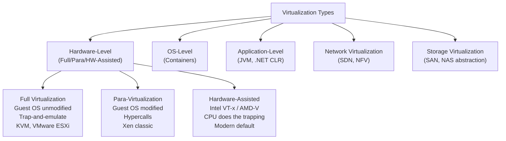
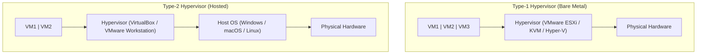
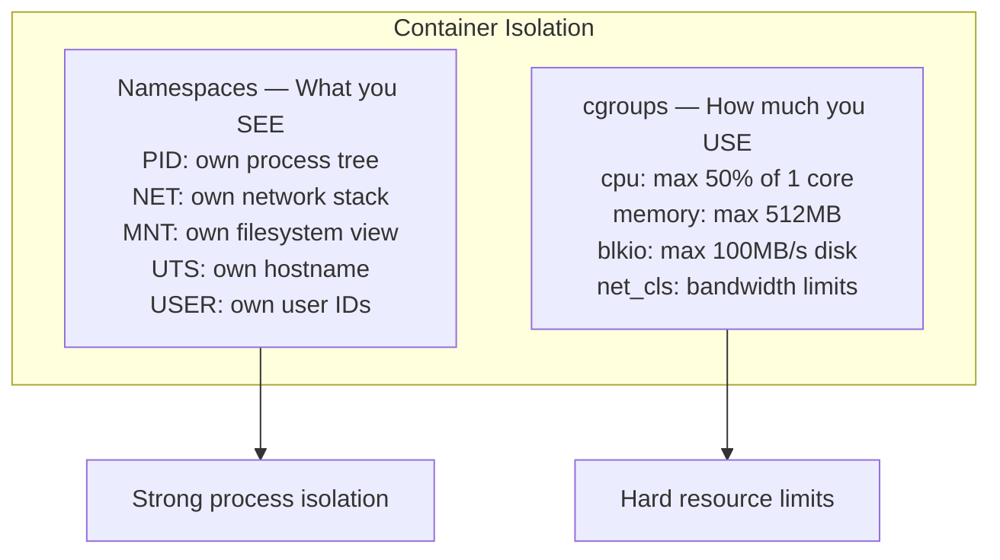
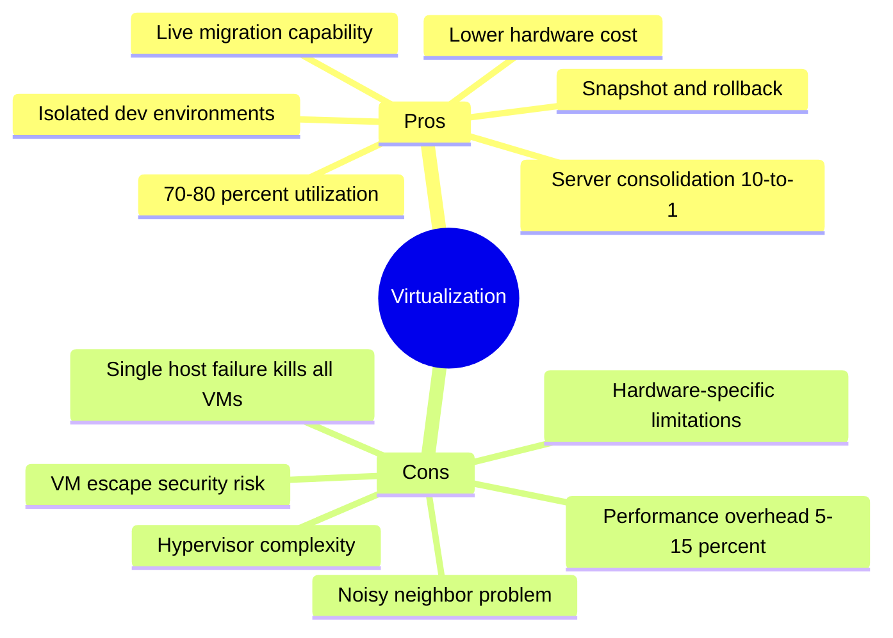

# A03 — Virtualization
**Track: Academic | Exam Weight: Unit 3 (~10 hrs) — LARGEST UNIT**

---

## 1. Definition and Core Purpose

**Virtualization:** Technology that creates an abstraction layer between software and hardware, allowing multiple virtual environments to share one physical machine.

**Why it matters:** Without virtualization, 1 server = 1 workload (10–15% utilization). With virtualization, 1 server = N workloads (70–80% utilization). This is the foundation of cloud economics.

---

## 2. Virtualization Types

### Type Comparison Table (High Exam Value)

| Factor | Full Virt | Para-Virt | OS-Level (Containers) |
|--------|-----------|-----------|----------------------|
| Guest OS | Unmodified | Modified | No separate OS |
| Isolation | Strong (hypervisor) | Strong (hypervisor) | Process-level |
| Performance | Good | Better | Best (~native) |
| Startup | ~30 seconds | ~20 seconds | < 1 second |
| Memory overhead | 100s MB | 100s MB | ~1–5 MB |
| OS compatibility | Any OS | Modified OS only | Same kernel as host |
| Examples | KVM, VMware, Hyper-V | Xen (PV mode) | Docker, LXC |

---

## 3. Type-1 vs Type-2 Hypervisors

| Factor | Type-1 | Type-2 |
|--------|--------|--------|
| Runs on | Bare metal | Host OS |
| Performance | High (direct HW) | Lower (host OS overhead) |
| Use case | Production data centers | Development, testing |
| Examples | ESXi, KVM, Hyper-V | VirtualBox, VMware Workstation |
| Boot time | Seconds | Minutes (host OS must boot) |

**KVM Trap:** Is KVM Type-1 or Type-2?  
**Answer: Type-1.** KVM is a Linux kernel module that converts the kernel into a hypervisor. The kernel IS the hypervisor — it manages hardware directly.

---

## 4. OS-Level Virtualization — Containers

**Container = Namespaces + cgroups + Layered filesystem**

### VM vs Container

| Factor | Virtual Machine | Container |
|--------|----------------|-----------|
| Size | GB | MB |
| Startup | 30–60 seconds | < 1 second |
| Isolation | Strong (own kernel) | Process-level (shared kernel) |
| OS support | Any OS | Must match host kernel |
| Use case | Strong isolation, different OS | Microservices, fast deploy |
| Performance overhead | ~5–15% | ~1–3% |

---

## 5. Virtualization and Cloud Computing

Virtualization enables multi-tenancy, which enables cloud economics.

**What virtualization enables for cloud:**
- Multi-tenancy — multiple customers on one physical server
- Live migration — move running VM to another host (zero downtime)
- Snapshots — save VM state, restore on failure
- Rapid provisioning — new VM in < 60 seconds
- Resource oversubscription — sell more vCPUs than physically exist

---

## 6. Pros and Cons of Virtualization

---

## 7. Data Center Technology

**PUE (Power Usage Effectiveness):** Total data center power ÷ IT equipment power.
- 1.0 = perfect (physically impossible)
- 1.1 = excellent (Google's average)
- 1.5 = industry average

**Hot aisle / Cold aisle containment:** Alternating rows of server racks — cold air intake faces cold aisle, hot exhaust faces hot aisle. Prevents hot and cold air mixing, improves cooling efficiency.

---

## 8. Containerization

**Docker architecture:** CLI → Docker Daemon (dockerd) → containerd → runc → Linux kernel (namespaces + cgroups)

**Docker image layers:** Each Dockerfile instruction creates a read-only layer. Container adds a writable layer on top. Layers shared between containers = storage efficiency.

---

## 9. Viva Questions — Unit 3

**Q: Is KVM Type-1 or Type-2? Explain.**  
A: Type-1. KVM is a loadable kernel module (`kvm.ko`, `kvm-intel.ko`). When loaded, it converts the Linux kernel into a Type-1 hypervisor. The kernel manages hardware directly. There is no separate host OS between KVM and hardware.

**Q: What is para-virtualization? Why is it faster?**  
A: The guest OS is modified to replace privileged instructions with hypercalls — direct calls to the hypervisor API. Faster because there's no trap-and-emulate overhead. The guest cooperates with the hypervisor instead of being deceived by it.

**Q: Why can't a Docker container run a different OS kernel?**  
A: Containers share the host kernel. The kernel is not virtualized. You can run Ubuntu libraries on a CentOS host container (different userspace), but the kernel is always the host's. This is why Windows containers can't run on Linux hosts.

**Q: What is a hypervisor escape? Why is it critical?**  
A: An attacker inside a VM exploits a hypervisor vulnerability to break out and access the host or other VMs. Critical because it breaks the fundamental security boundary of cloud multi-tenancy. Hypervisor escapes are rare but catastrophic when they occur.

**Q: What is the noisy neighbor problem?**  
A: When a co-tenant VM consumes excessive physical resources (CPU bursts, heavy disk I/O), it degrades performance for other VMs on the same host. Mitigated by: CPU credits (t-series), dedicated instances, placement groups, and resource limits.
