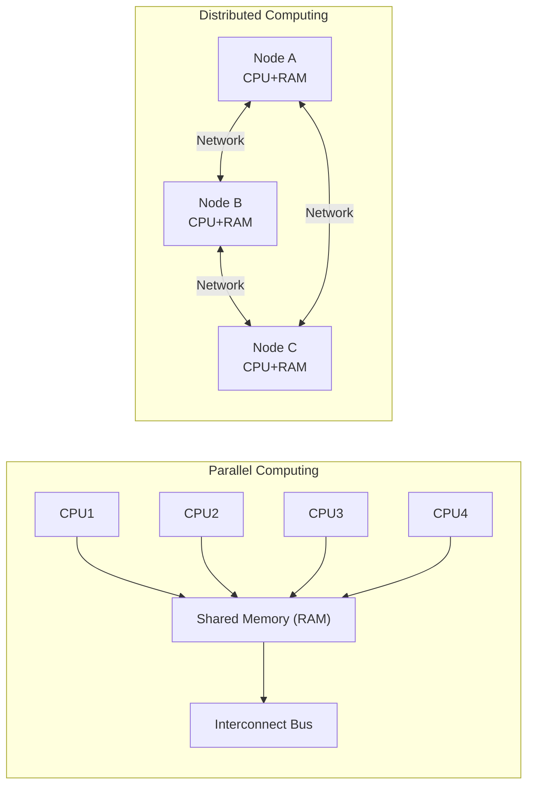
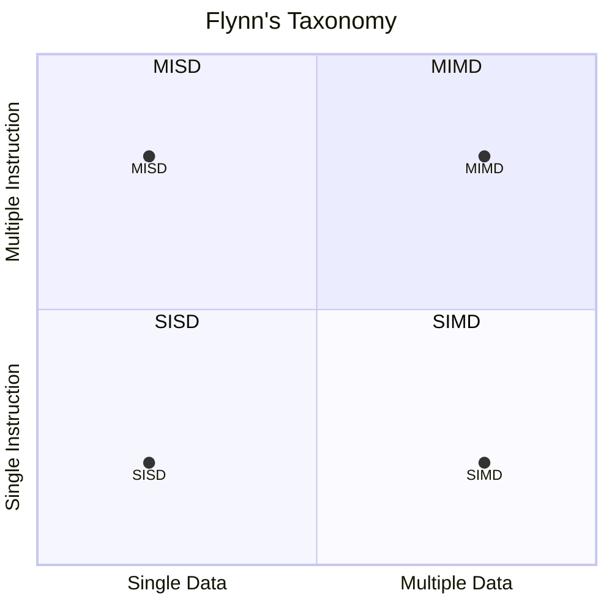
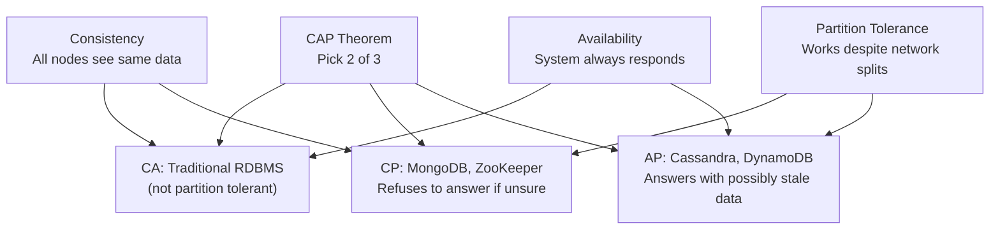

# A04 — Parallel and Distributed Computing
**Track: Academic | Exam Weight: Unit 2 (~6 hrs)**

---

## 1. Parallel vs Distributed

| Factor | Parallel | Distributed |
|--------|---------|-------------|
| Location | Same machine | Multiple machines |
| Memory | Shared | Each node owns its memory |
| Communication | Shared memory reads/writes | Message passing over network |
| Coupling | Tight | Loose |
| Synchronization | Common clock | No global clock |
| Failure model | All-or-nothing | Partial failures possible |
| Primary goal | Raw speed | Scale + fault tolerance |

---

## 2. Flynn's Taxonomy

| Classification | Example | Use |
|---------------|---------|-----|
| SISD | Single-core CPU | Traditional sequential |
| SIMD | GPU, Intel AVX | Vector operations, graphics |
| MISD | Space shuttle computers | Redundant fault-tolerant |
| MIMD | Multi-core CPU, cluster | General parallel computing |

---

## 3. CAP Theorem

**Real-world:** Network partitions always happen. True choice is CP or AP. CA is only theoretical (single server).

---

## 4. System Architectural Styles

**Client-Server:** Client requests, server responds. Central control. Examples: Web apps, email.

**Peer-to-Peer:** Every node is both client and server. No central authority. Examples: BitTorrent, Bitcoin.

**Three-Tier:** Presentation → Application → Data. Standard web architecture.

**Microservices:** Application split into small independent services, each deployable separately.

---

## 5. Viva Questions — Unit 2

**Q: Explain CAP theorem with a real example.**  
A: In distributed systems, pick 2 of: Consistency, Availability, Partition Tolerance. Example: Cassandra chooses AP — stays available during network partition but may serve slightly stale data. ZooKeeper chooses CP — refuses to answer rather than give inconsistent data.

**Q: What is the difference between message passing and shared memory?**  
A: Shared memory: processes communicate by reading/writing shared RAM (fast, but needs synchronization — mutexes/semaphores). Message passing: processes communicate by sending explicit messages over network/IPC (slower, but works across machines, no shared state).
