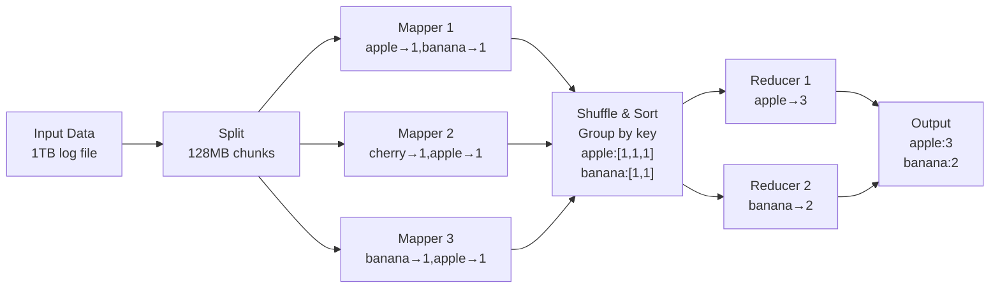
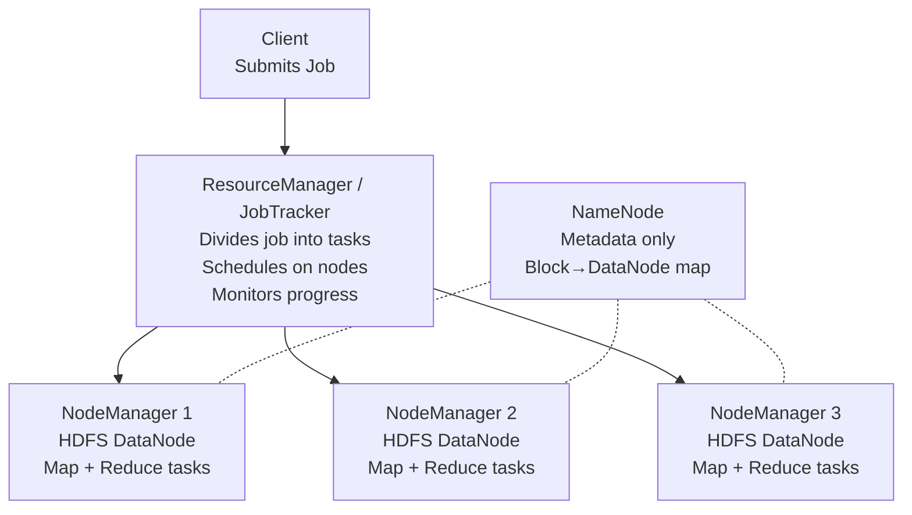

# A05 — Data-Intensive Computing: MapReduce
**Track: Academic | Exam Weight: Unit 5 (~6 hrs)**

---

## 1. MapReduce Model

**Data locality principle:** Move compute to data, not data to compute. Map tasks run ON the nodes storing the data. Avoids massive network transfer.

---

## 2. Hadoop Architecture

### HDFS

- Block size: **128MB** (default)
- Replication: **3x** (default) — across AZs/racks
- NameNode stores only metadata (block locations), not actual data
- Loss of NameNode = cluster failure (SecondaryNameNode / HA NameNode mitigates)

---

## 3. MapReduce vs Spark

| Factor | MapReduce | Apache Spark |
|--------|-----------|-------------|
| Intermediate storage | Disk (HDFS) | Memory (RAM) |
| Iterative algorithms | Slow (disk I/O each pass) | Fast (in-memory) |
| Speed | Baseline | 10–100x faster |
| Fault tolerance | Disk checkpoints | Lineage (RDD recompute) |
| Use case | Large batch ETL | Iterative ML, streaming |

---

## 4. Viva Questions — Unit 5

**Q: What is data locality? Why does it matter?**  
A: Running Map tasks on the nodes that store the data. Avoids network transfer of 128MB blocks — network latency would make MapReduce orders of magnitude slower.

**Q: Why 3x replication in HDFS?**  
A: Tolerates: one DataNode failure (common), one rack failure (switch fails). Maintains read performance (3 copies = 3 parallel reads possible). Trade-off: 3x storage cost.

**Q: Why is Spark faster than MapReduce for ML?**  
A: ML training is iterative — same data processed many times. MapReduce writes intermediate results to HDFS after every iteration. Spark keeps RDDs in memory across iterations. For 10 iterations: Spark = 10 memory reads. MapReduce = 10 HDFS writes + 10 HDFS reads.