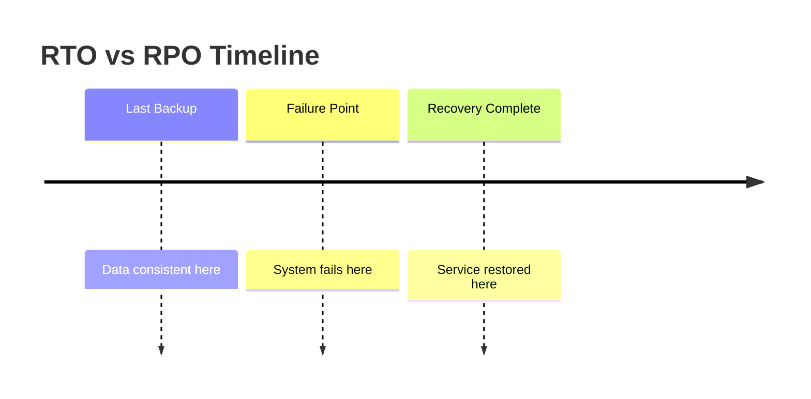

# A06 — Cloud Computing Management
**Track: Academic | Exam Weight: Unit 6 (~6 hrs)**

---

## 1. CapEx vs OpEx

| | Capital Expenditure | Operational Expenditure |
|--|-------------------|------------------------|
| What | Upfront hardware purchase | Monthly cloud bill |
| When paid | Before you use it | After you use it |
| Flexibility | Fixed | Variable |
| Balance sheet | Asset (depreciates) | Expense |
| Cloud relevance | On-premise model | Cloud model |

**Cloud converts IT from CapEx to OpEx.** No upfront server purchase. Pay as you go.

---

## 2. TCO — Total Cost of Ownership

**Common hidden on-premise costs:**

| Cost Category | Examples | Annual Cost (estimate) |
|--------------|---------|----------------------|
| Hardware | Servers, networking, storage | ₹15–50 lakhs (upfront) |
| Power | Server + cooling electricity | ₹3–6 lakhs/yr |
| Colocation | Rack space, cooling, security | ₹2–4 lakhs/yr |
| Personnel | Sysadmin, security, DBA | ₹10–20 lakhs/yr |
| Software licenses | OS, backup, monitoring | ₹1–2 lakhs/yr |
| Disaster recovery | Second site, backup infra | ₹10–30 lakhs |
| Hardware refresh | Every 3–5 years | ₹15–50 lakhs |
| Downtime cost | Revenue loss during outages | Variable |

AWS TCO Calculator: `calculator.aws` — compare on-premise vs cloud.

---

## 3. SLA — Service Level Agreement

**Definition:** Contractual guarantee specifying service levels and remedies for failure to meet them.

### Uptime Calculation

| SLA | Downtime/Year | Downtime/Month |
|-----|--------------|----------------|
| 99% | 87.6 hours | 7.3 hours |
| 99.9% | 8.76 hours | 43.8 minutes |
| 99.99% | 52.6 minutes | 4.38 minutes |
| 99.999% | 5.26 minutes | 26 seconds |

**S3 durability: 99.999999999% (11 nines)** — if you store 10 million objects, expect to lose 1 every ~10,000 years.

### RTO vs RPO

- **RPO (Recovery Point Objective):** How much data you can lose. Time between last backup and failure. Determines backup frequency.
- **RTO (Recovery Time Objective):** How long recovery can take. Time from failure to restoration. Determines failover architecture.

---

## 4. Viva Questions — Unit 6

**Q: What does 99.99% uptime mean in actual downtime?**  
A: 52.6 minutes per year, or 4.38 minutes per month.

**Q: What is TCO? What costs do companies typically miss?**  
A: Total Cost of Ownership — ALL costs over asset lifetime. Missed: power, cooling, rack space, IT staff time, hardware refresh cycle, DR site, software licenses, downtime revenue loss.

**Q: Difference between RTO and RPO?**  
A: RTO = time to restore (how fast recovery). RPO = data you can lose expressed as time (backup frequency). Example: RPO = 1 hour means backups every hour; RPO = 0 means synchronous replication.