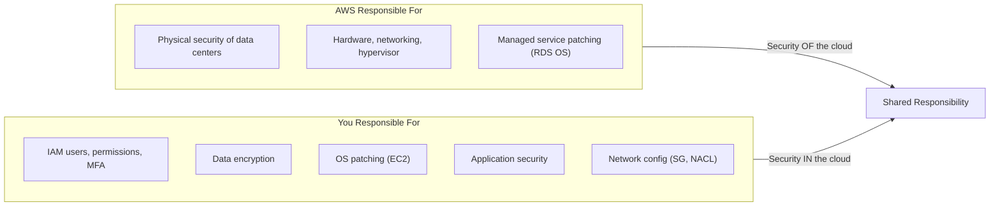

# A07 — Cloud Security
**Track: Academic | Exam Weight: Unit 7 (~5 hrs)**

---

## 1. Shared Responsibility Model

---

## 2. IAM

**Evaluation logic:** Default DENY → Explicit ALLOW → Explicit DENY (wins over ALLOW, cannot be overridden)

| Component | Description |
|-----------|------------|
| User | Permanent identity for a person |
| Group | Collection of users sharing policies |
| Role | Temporary identity for services/cross-account |
| Policy | JSON document defining permissions |
| MFA | Second factor — phone app or hardware token |

**Least privilege:** Grant only minimum permissions required. A Lambda that reads from one S3 bucket gets only `s3:GetObject` on that bucket ARN.

---

## 3. Encryption

**At rest (S3):**
- SSE-S3: AWS manages keys. Simpler. No audit trail per object.
- SSE-KMS: You control key in KMS. CloudTrail logs every decrypt. Revoke key = data inaccessible. Required for compliance.

**In transit:** TLS 1.2/1.3. HTTPS. AWS Certificate Manager (ACM) = free certs, auto-renew.

---

## 4. Cloud Security Risks

| Risk | Cause | Mitigation |
|------|-------|-----------|
| Data breach | Misconfigured S3, weak IAM | Encryption, block public access, least privilege |
| Account hijacking | Weak passwords, no MFA | MFA mandatory, strong passwords |
| DoS/DDoS | Flood of requests | AWS Shield, WAF, CloudFront |
| Data loss | Accidental deletion | Versioning, MFA delete, backups |
| Insider threats | Rogue employee | Least privilege, CloudTrail, alerts |

---

## 5. Viva Questions — Unit 7

**Q: What is the shared responsibility model?**  
A: AWS secures the infrastructure (hardware, data centers, hypervisor). You secure everything you deploy ON the infrastructure (data, OS config, IAM, application, network settings).

**Q: What is the IAM policy evaluation order?**  
A: (1) Default = deny all. (2) Explicit ALLOW grants access. (3) Explicit DENY overrides any ALLOW and cannot be overridden by any ALLOW.

**Q: SSE-S3 vs SSE-KMS — when would you use KMS?**  
A: SSE-KMS when: compliance requires audit trail of data access, you need to revoke access to encrypted data, you need separate key policies per dataset. Banks, healthcare (HIPAA), government.