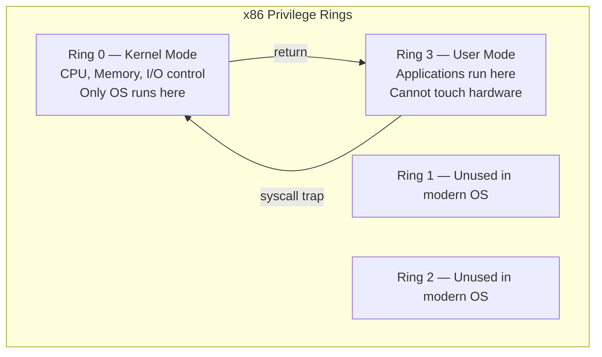
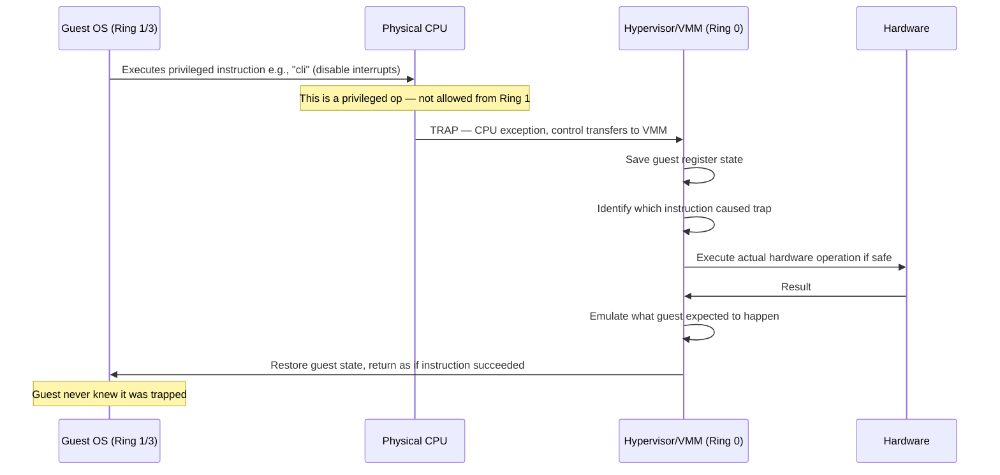
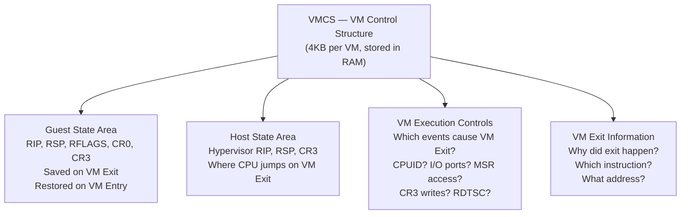
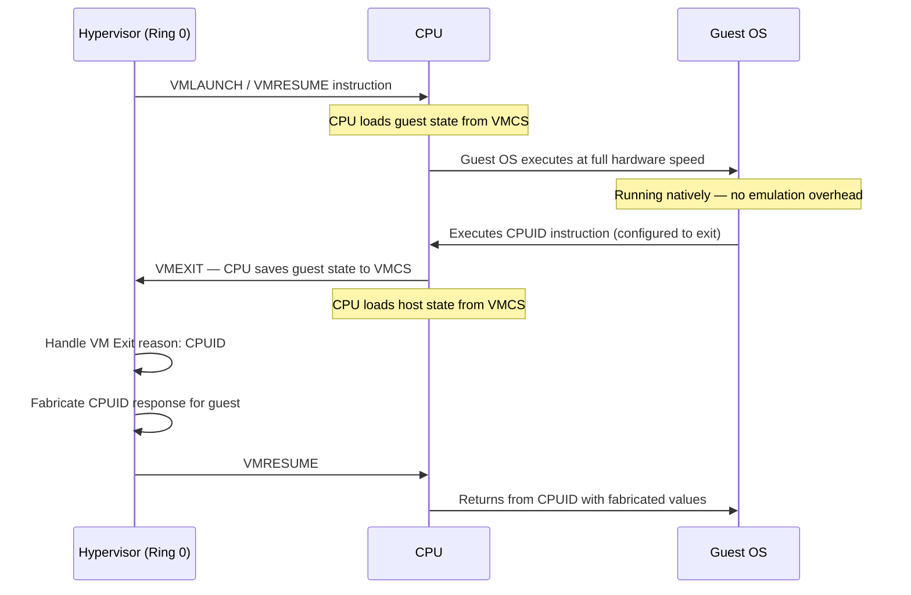
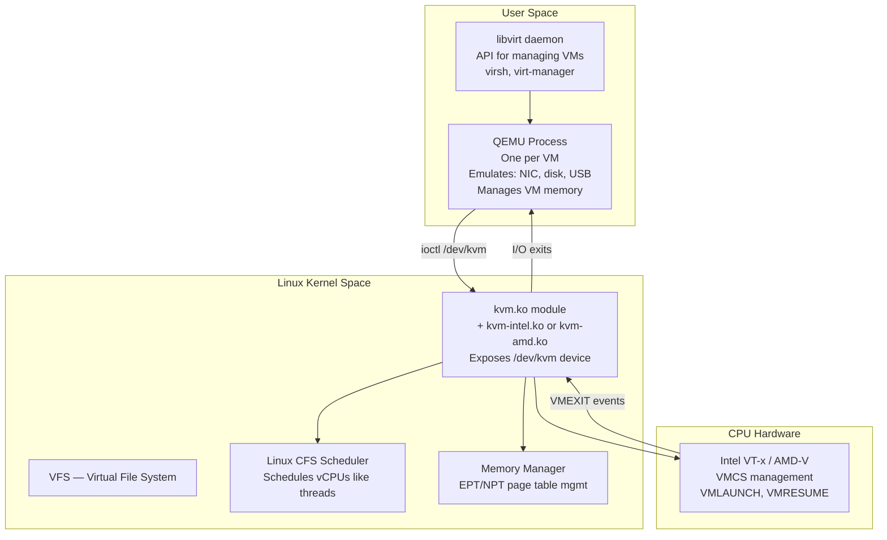
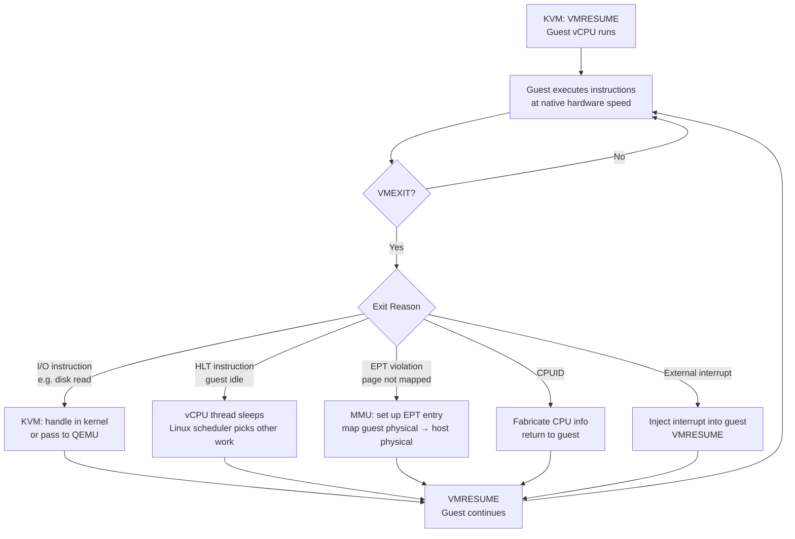
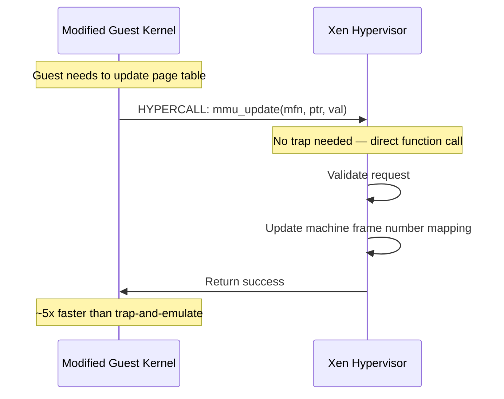
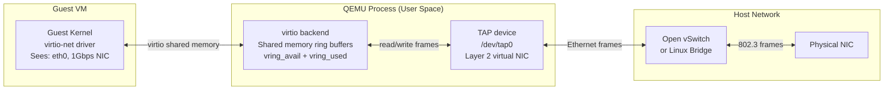
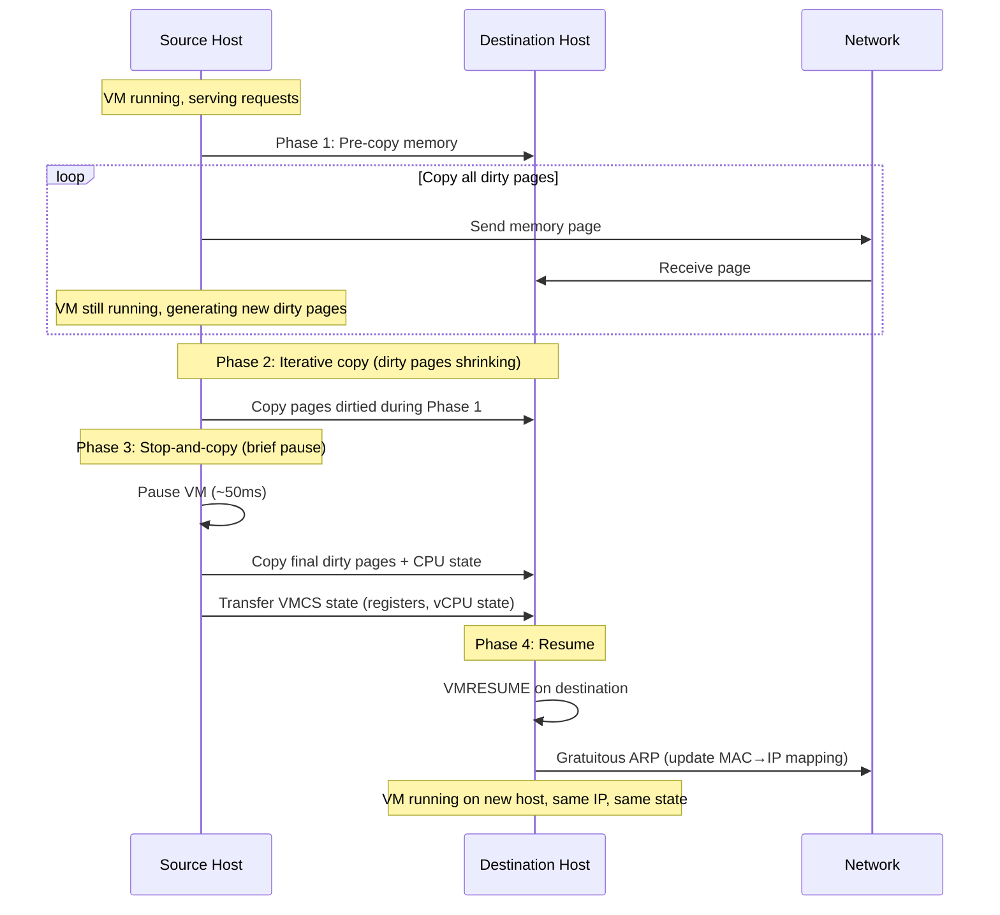
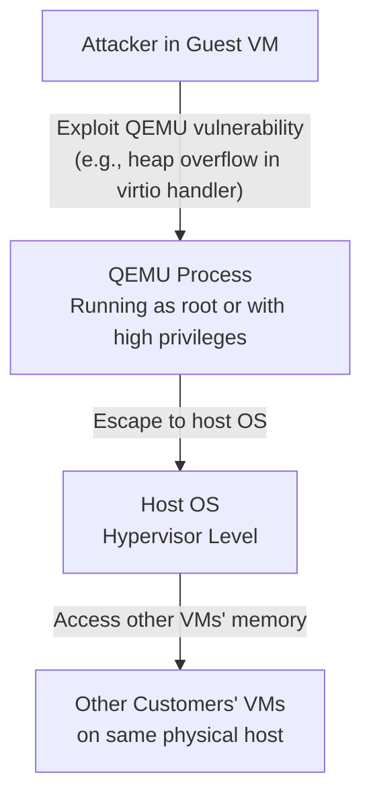

# D01 — Virtualization Internals
**Track: Deep Dive | How the hypervisor actually works under the hood**

---

## 1. The Problem Virtualization Solves — At Hardware Level

Before virtualization, the x86 architecture had a fundamental problem: **the ring privilege model breaks when you try to run an OS inside another OS.**



**The virtualization problem:** A guest OS expects to run in Ring 0. But if it's already running inside a host OS, Ring 0 is taken by the hypervisor. When the guest OS executes a privileged instruction (like `MOV CR3` to change page tables), one of three things happens:
1. CPU silently ignores it — guest OS breaks
2. CPU crashes the guest
3. CPU traps to hypervisor — hypervisor emulates — guest continues

Option 3 is the basis of **trap-and-emulate virtualization.**

---

## 2. Full Virtualization — Trap-and-Emulate Internals



**Performance cost:** Each trap = thousands of CPU cycles (context save, VMM decision, emulation, context restore). On a workload that frequently executes privileged instructions, this overhead becomes significant.

---

## 3. Intel VT-x and AMD-V — Hardware-Assisted Virtualization

Intel and AMD added hardware support specifically to make virtualization efficient. This is called **Intel VT-x (Virtualization Technology for x86)** and **AMD-V (AMD Virtualization)**.

### VMCS — VM Control Structure

The core Intel VT-x data structure. Every VM has its own VMCS — a 4KB memory region that the CPU uses to track VM state.



### VMENTER and VMEXIT — The Two Hardware Instructions



**Key insight:** With VT-x, the CPU natively switches between host and guest mode. No software emulation of privilege levels. The guest runs in a new CPU mode called **VMX non-root operation** — it has near-native performance, but certain operations still cause VMEXIT to the hypervisor.

---

## 4. KVM Architecture — Deep Internals

KVM (Kernel-based Virtual Machine) is Linux's virtualization module. Understanding it means understanding how AWS EC2 actually works.



### The vCPU Execution Loop



### EPT — Extended Page Tables

Without EPT (software shadow page tables): every guest page table change triggers a VMEXIT. With EPT (hardware-supported):

```
Guest Virtual → Guest Physical → Host Physical
     └── Guest page tables      └── EPT (hardware-walked by MMU)

Without EPT: VMM must intercept every CR3 write, maintain shadow page tables = expensive
With EPT: CPU hardware walks both tables autonomously = near-native memory performance
```

---

## 5. Para-Virtualization Internals — Xen Hypercalls

In para-virtualization (Xen PV mode), the guest OS is modified to replace privileged instructions with **hypercalls** — direct function calls into the hypervisor.



**Hypercall table:** The Xen hypervisor exposes a set of hypercall functions at a known memory address. The modified guest kernel calls these directly using `SYSCALL` or `INT` — no hardware trap overhead.

---

## 6. QEMU Device Emulation — How VMs Get NICs and Disks

QEMU emulates all peripheral devices that the guest OS sees. This is how an EC2 instance gets a "NIC" and "disk" without access to real hardware.



**virtio vs full emulation:**
- Full emulation: QEMU emulates Intel e1000 NIC register-by-register. Every guest I/O = VMEXIT + QEMU handling.
- virtio: Shared memory ring buffers. Guest writes packet descriptor to ring. QEMU picks it up without VMEXIT. ~3x faster.

---

## 7. Live VM Migration — Internals

How AWS moves your EC2 instance between physical hosts with ~50ms downtime:



**Why only ~50ms pause?** The final stop-and-copy only transfers the pages dirtied in the last iteration — typically a few MB, which takes milliseconds at LAN speeds.

---

## 8. Failure Scenarios

### Hypervisor Crash — What Happens to VMs?

If KVM/QEMU process crashes on one host, ALL VMs on that host die. This is why:
- AWS spreads your ASG across multiple AZs (different physical hosts)
- RDS Multi-AZ uses synchronous replication to standby in a different host
- EBS stores data independently of the EC2 instance

### VM Escape — The Critical Security Failure



**Real examples:** VENOM (2015) — QEMU floppy drive vulnerability allowed VM escape. CVE-2019-14835 (vhost-net buffer overflow). AWS Nitro was partly designed to shrink the attack surface by moving device emulation to dedicated hardware (no QEMU).

---

## 9. Trade-offs Summary

| Technology | Benefit | Cost | Use When |
|-----------|---------|------|----------|
| Full virt (no HW assist) | Works on any CPU | High VMEXIT overhead | Legacy hardware |
| HW-assisted (VT-x/AMD-V) | Near-native CPU speed | Still I/O VMEXIT | Modern VMs (default) |
| Para-virt (Xen PV) | Fast I/O + memory | Modified guest OS | Old Xen deployments |
| virtio | Fast I/O (no VMEXIT for NIC/disk) | Guest needs virtio drivers | All modern Linux VMs |
| EPT/NPT | Fast memory translation | Slightly larger VMEXIT for EPT faults | All modern x86 |
| Containers | Near-native, low overhead | Weak isolation, shared kernel | Trusted workloads |
