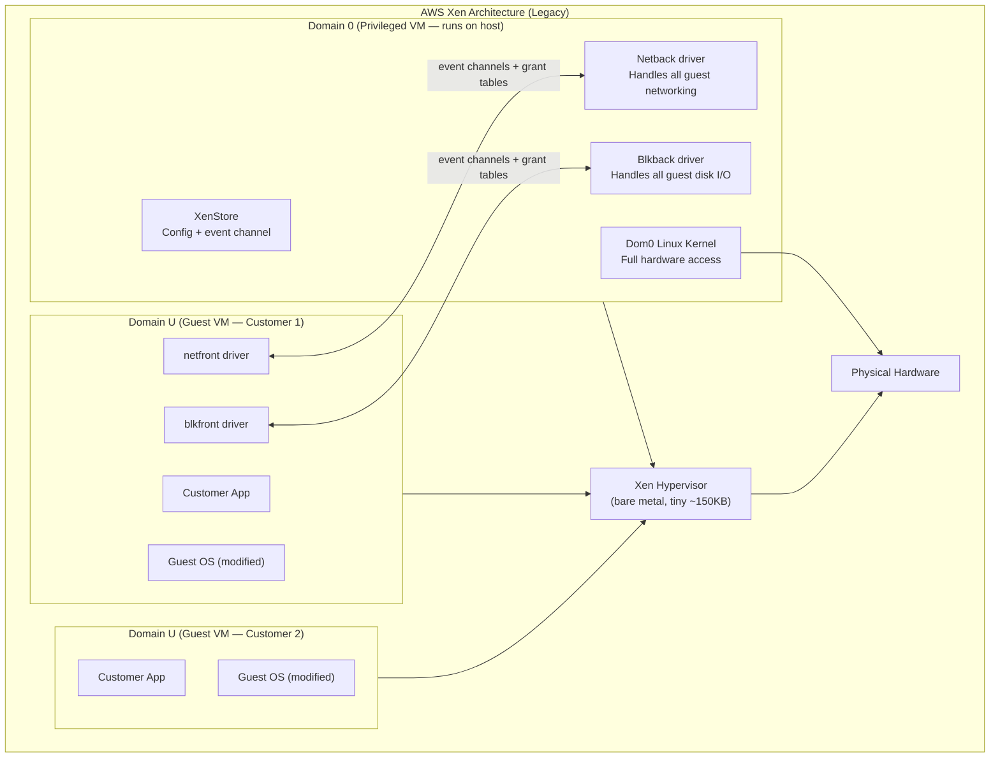
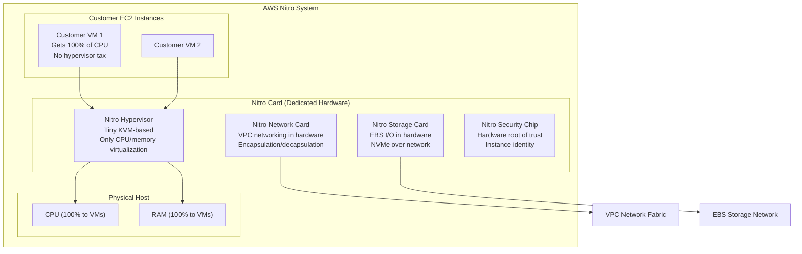
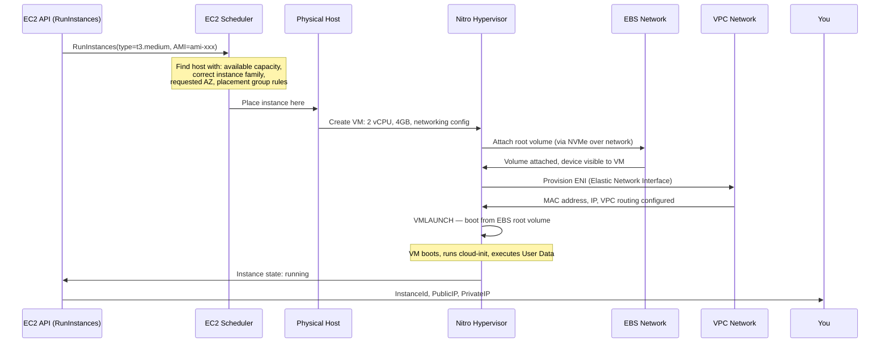
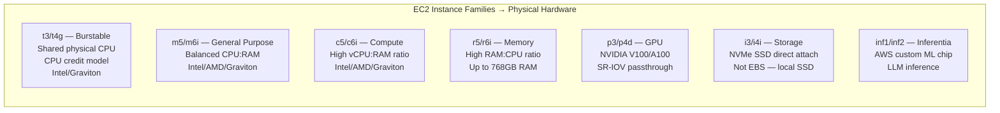
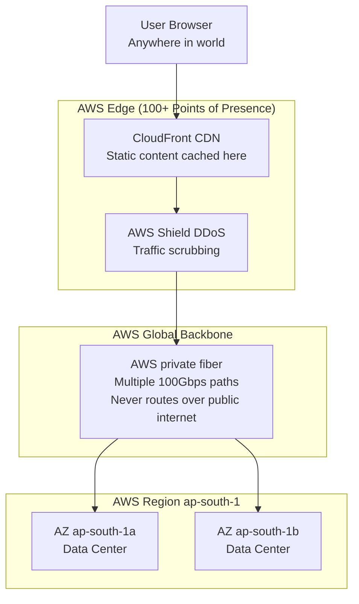
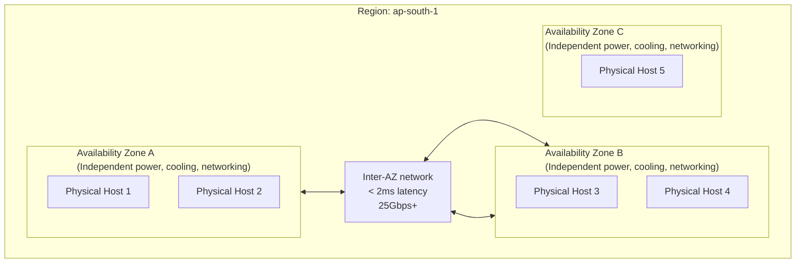

# D02 — AWS Infrastructure Internals
**Track: Deep Dive | How EC2 actually works inside Amazon**

---

## 1. The Xen Era (2006–2017) — How AWS Was Originally Built

AWS launched EC2 in 2006 using the **Xen hypervisor** in para-virtualized mode.



**The Dom0 problem:** Dom0 was a full Linux VM with hardware access. It was a large privileged attack surface. If Dom0 was compromised, all customer VMs on that host were compromised. Also, Dom0 consumed significant CPU and memory resources just for I/O handling.

---

## 2. The Nitro System (2017–present) — AWS's Custom Hypervisor

AWS built Nitro to fix Xen's Dom0 problem: move device emulation and security functions off the main CPU and onto dedicated hardware.



### Before and After Nitro

| Aspect | Xen (Pre-Nitro) | Nitro |
|--------|----------------|-------|
| Hypervisor size | Full Xen + Dom0 | Tiny KVM-based core |
| CPU overhead | ~10–15% (Dom0 + Xen) | < 1% (hardware offload) |
| I/O handling | Dom0 CPU | Dedicated Nitro card |
| Networking | Dom0 Linux software | Nitro NW card (hardware) |
| Attack surface | Large (Dom0 = full Linux) | Minimal (tiny firmware) |
| Bare metal support | No | Yes (Nitro with no VM layer) |

**Result:** On Nitro, the hypervisor overhead is so small that AWS introduced **bare metal instances** — EC2 instances with NO hypervisor overhead at all (you get raw hardware, used for licensing requirements, custom hypervisors, nested virtualization).

---

## 3. EC2 Instance Lifecycle — Full Internal Flow



---

## 4. EC2 Instance Types — Hardware Mapping



### CPU Oversubscription in t-family Instances

t2/t3 instances use CPU credits. The physical host is oversubscribed — more vCPUs sold than physical cores available.

```
Physical host: 48 physical cores
t3.micro VMs: 2 vCPUs each → can sell 200+ t3.micro instances

When CPU is idle: vCPUs run at full speed, earn credits
When CPU spikes: credits consumed, eventually throttled to "baseline"
t3.micro baseline: 10% of 1 vCPU
```

For sustained CPU workloads: use m/c/r family. For burst workloads: t family is cheap and sufficient.

---

## 5. EBS Architecture — How EC2 Disk I/O Actually Works

EBS is NOT a local disk. It is a **network-attached block device** delivered over AWS's internal network.

```mermaid
graph LR
    subgraph EC2_Host["EC2 Physical Host"]
        VM["Your EC2 VM"]
        NitroStorage["Nitro Storage Controller<br/>NVMe interface to VM"]
    end

    subgraph EBS_Network["EBS Internal Network (25Gbps+)"]
        Net["Dedicated storage network<br/>Separate from EC2 data network"]
    end

    subgraph EBS_Fleet["EBS Storage Fleet"]
        EBSNode1["EBS Storage Node<br/>SSDs/HDDs"]
        EBSNode2["EBS Storage Node<br/>Replicated copy"]
    end

    VM -->|NVMe commands| NitroStorage
    NitroStorage -->|NVMe over Fabric (NVMeoF)| Net
    Net --> EBSNode1 & EBSNode2
```

**Implications:**
- EBS latency: ~0.5–2ms (network round trip)
- Local instance store (i3/i4i): ~0.01ms (physically on host)
- EBS survives EC2 instance death (data on separate fleet)
- io2 Block Express: ~500K IOPS, ~0.1ms latency (dedicated path)

---

## 6. AWS Global Network — How Traffic Gets to Your EC2



**Key facts for exams:**
- Traffic between AWS services in the same region stays on AWS backbone (not public internet)
- Cross-region traffic also uses AWS backbone (not public internet)
- AWS has 100+ edge PoPs (Points of Presence) for CloudFront
- Transfer within same AZ: free. Cross-AZ: $0.01/GB. Cross-region: $0.02–0.09/GB.

---

## 7. The Graviton Processor — AWS Custom ARM CPU

AWS designed its own CPU for EC2: **AWS Graviton (ARM-based)**.

```
Graviton1 (2018): 16-core ARM Cortex-A72
Graviton2 (2020): 64-core Neoverse N1 — 7nm, 40% better price-performance vs x86
Graviton3 (2022): 64-core Neoverse V1 — 25% better than Graviton2
Graviton4 (2024): 96-core — 30% better than Graviton3
```

**Why AWS built its own CPU:**
- x86 licensing: Intel/AMD charge per socket — expensive at cloud scale
- Custom features: hardware-specific instructions optimized for cloud workloads
- Vertical integration: AWS controls the full stack (chip → hypervisor → EC2)
- Cost: ~40% cheaper than equivalent x86 EC2 instances

**Trade-off:** ARM architecture. Applications compiled for x86 must be recompiled. Python, Java, Node.js = works fine (JIT or interpreted). Native binaries = must recompile.

---

## 8. Failure Analysis: EC2 Availability Zone Design



**Failure model:**
- Single instance failure: ~1 in 10,000 instance-hours (hardware defect, hypervisor crash)
- Single AZ failure: Rare but happens (power: us-east-1 2012, cooling: us-east-1 2023)
- Single region failure: Extremely rare (us-east-1 2021 was partial)
- Multi-region failure: Has not happened for major AWS regions

**Design implication:** For 99.99% availability, deploy across 2+ AZs with ALB and health checks. A single AZ gives ~99.9% at best.
