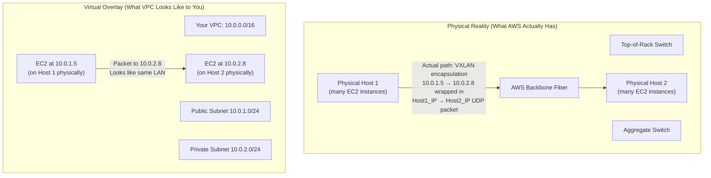
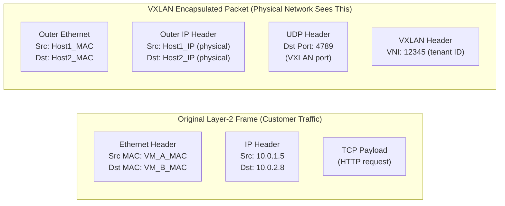
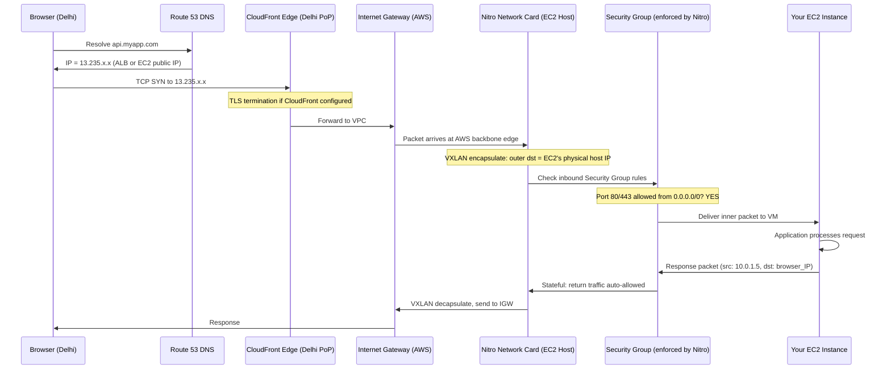
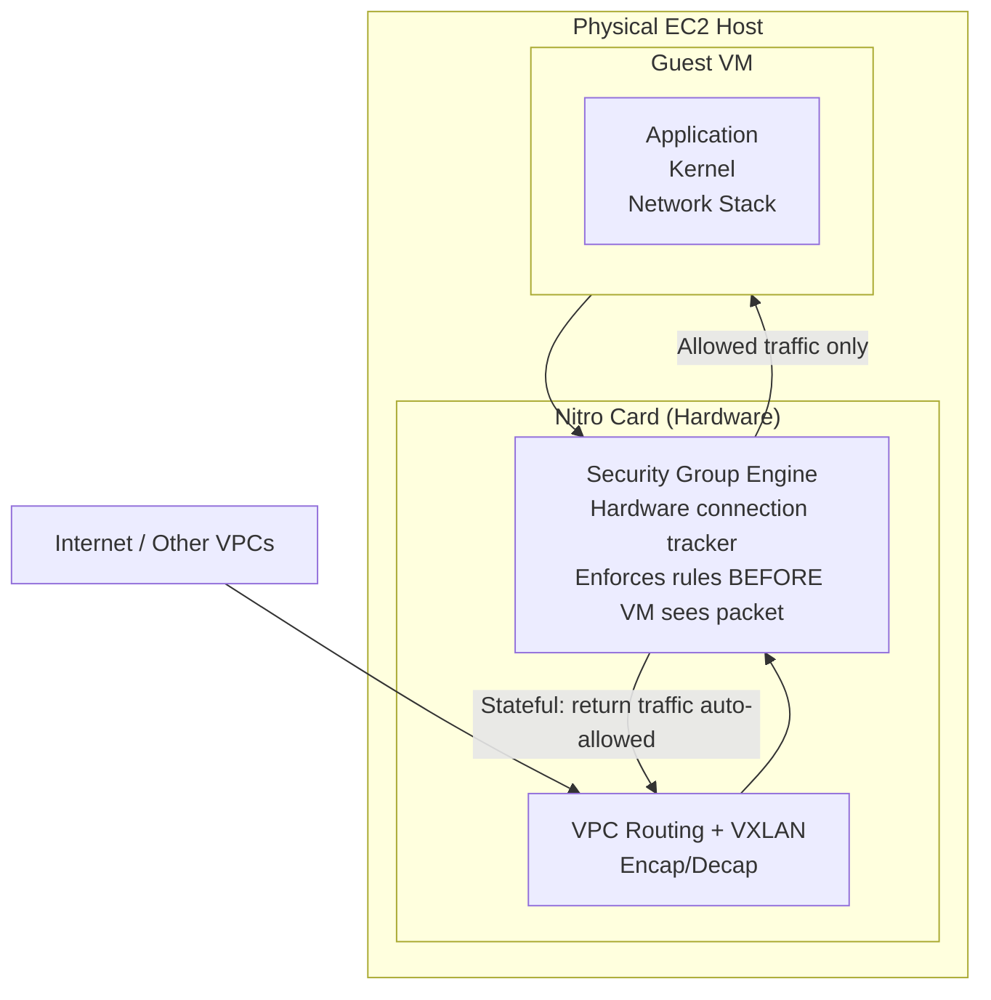
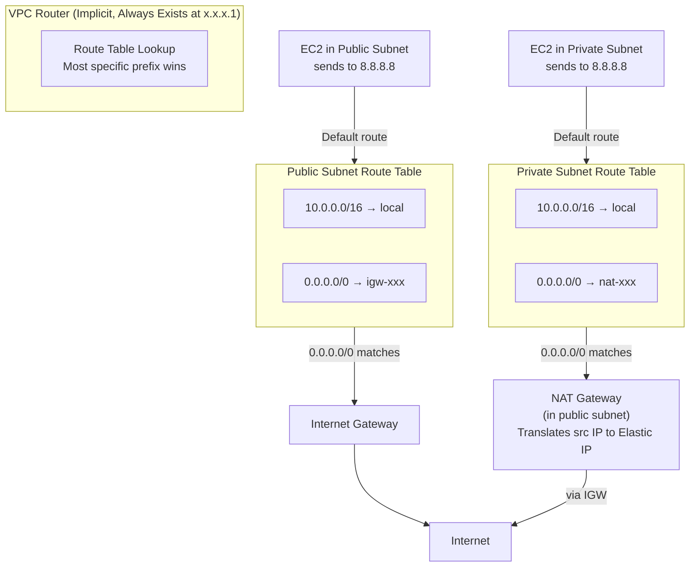
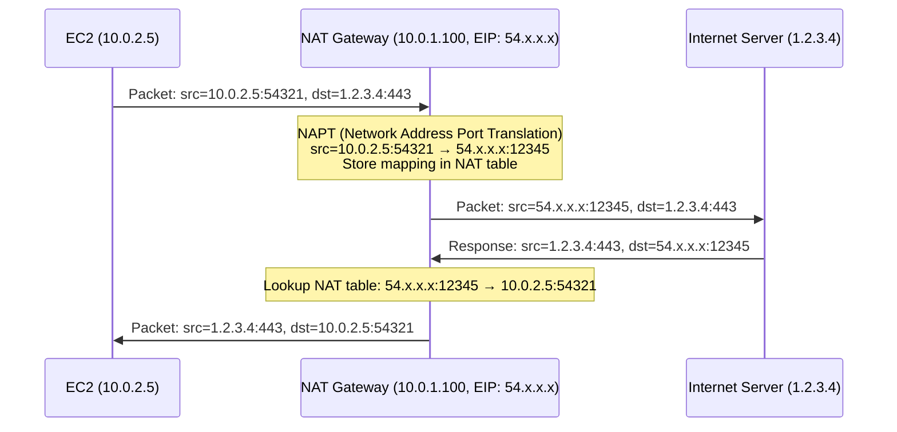
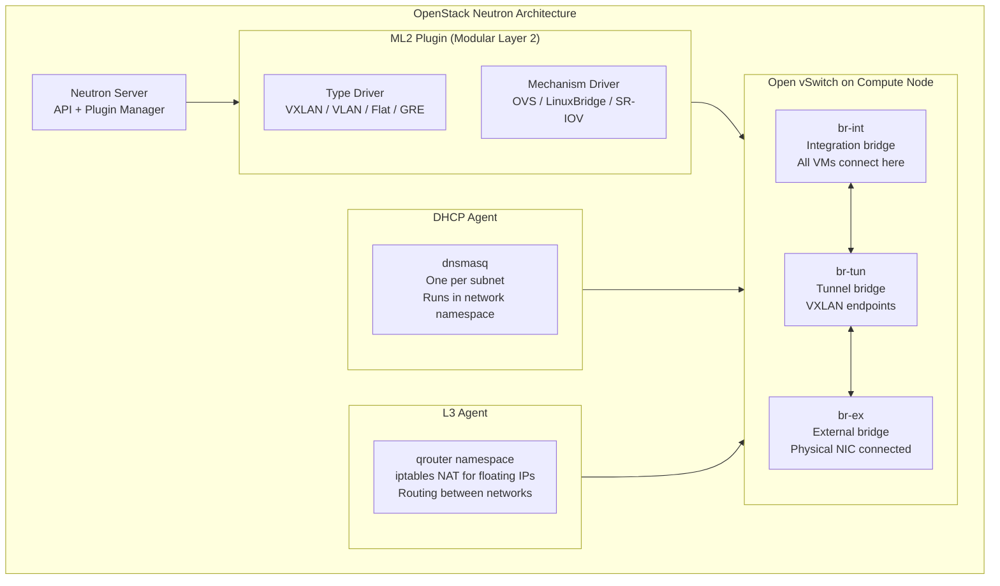
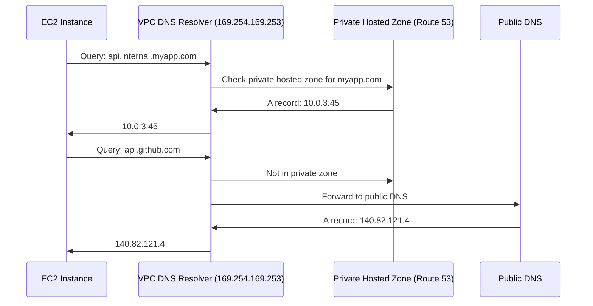

# D03 — Networking Internals
**Track: Deep Dive | How a packet travels from your laptop to EC2 and back**

---

## 1. VPC Architecture — Not Just a Diagram, The Actual Stack

A VPC is not a separate physical network. It is an **overlay network** implemented in software on top of AWS's physical network.

**The overlay trick:** When EC2_A at 10.0.1.5 sends a packet to EC2_B at 10.0.2.8, the Nitro card encapsulates the entire Ethernet frame inside a VXLAN UDP packet addressed from Host1's physical IP to Host2's physical IP. The physical network only sees host-to-host traffic. The VPC overlay is invisible to the physical switches.

---

## 2. VXLAN — The Encapsulation Protocol

VXLAN (Virtual Extensible LAN) is how AWS implements VPC overlay networks.

**VNI (VXLAN Network Identifier):** 24-bit field — supports up to 16 million distinct virtual networks. Each VPC gets a VNI. Traffic in VPC A with VNI=100 cannot be delivered to VPC B with VNI=200 — the physical switches would just forward the outer packet; the Nitro card on the destination host checks VNI and only delivers to the correct VM.

---

## 3. Packet Flow — Internet → Your EC2

This is the complete path of an HTTP request from a browser in Delhi to your EC2 in Mumbai (ap-south-1).

---

## 4. Security Groups — How They're Implemented

Security Groups are NOT iptables rules in the guest OS. They are enforced at the **Nitro card level** — outside the VM.

**Why this matters for security:** The VM cannot bypass Security Groups by modifying its own iptables. Security Groups are enforced at the hypervisor/hardware level. Even if the guest OS is fully compromised, it cannot receive traffic not allowed by the Security Group.

**Stateful implementation:** The Nitro card maintains a connection tracking table (similar to Linux conntrack). When an inbound connection is established, the (src_ip, src_port, dst_ip, dst_port, protocol) tuple is stored. Return traffic matching this tuple is automatically allowed without a separate outbound rule evaluation.

---

## 5. VPC Routing — How Subnets Actually Route

**Longest prefix match:** If a route table has both `10.0.0.0/16 → local` and `10.0.1.0/24 → transit-gw`, a packet to `10.0.1.5` matches BOTH. The `/24` is more specific → transit-gw wins.

---

## 6. NAT Gateway Internals

NAT Gateway is not a simple IP masquerade. It is an AWS-managed network appliance:

**Why private subnet instances can initiate but not receive:** The NAT table entry is created only when the private instance initiates the connection. There's no entry for an internet server initiating to the NAT public IP — it has nowhere to forward it (no port mapping exists). This is the "outbound only" property.

---

## 7. OpenStack Neutron Internals — ML2 Plugin and OVS

**Packet path in OpenStack Neutron:**
1. VM sends packet → TAP device → br-int (local switching)
2. br-int → br-tun (VXLAN encapsulation with VNI)
3. VXLAN packet traverses physical network
4. Destination host: br-tun decapsulates → br-int → TAP → destination VM

---

## 8. DNS Resolution Inside a VPC

**VPC DNS resolver:** Every VPC has a built-in DNS resolver at the 2nd IP of the VPC CIDR (e.g., 10.0.0.2 for 10.0.0.0/16), also reachable at 169.254.169.253. It handles Route 53 Private Hosted Zones and forwards public DNS queries to AWS public resolvers.

---

## 9. Network Performance Limits and Trade-offs

| Feature | Mechanism | Limit | Trade-off |
|---------|-----------|-------|-----------|
| Enhanced Networking (ENA) | SR-IOV + virtio-net | Up to 100Gbps | Requires ENA driver in guest |
| Placement Groups (cluster) | Same physical rack | Lowest latency | Single AZ, hardware failure risk |
| Placement Groups (spread) | Different racks | Highest HA | Max 7 instances per AZ |
| Jumbo frames | MTU 9001 within VPC | ~15% throughput gain | Only works within VPC, not internet |
| NAT Gateway bandwidth | Managed scaling | 45Gbps burst | $0.045/GB data processed |
| Internet Gateway | No bandwidth limit | AWS throttles abusers | Egress: $0.09/GB to internet |
