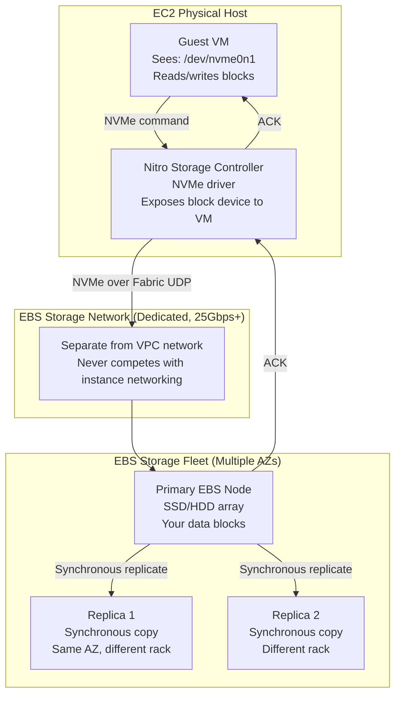
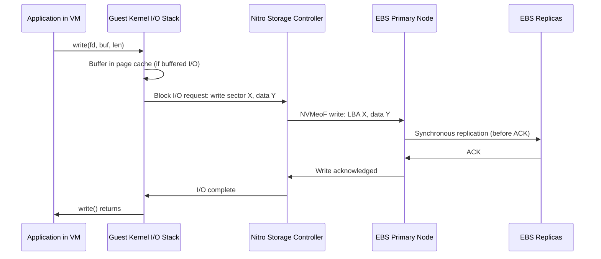
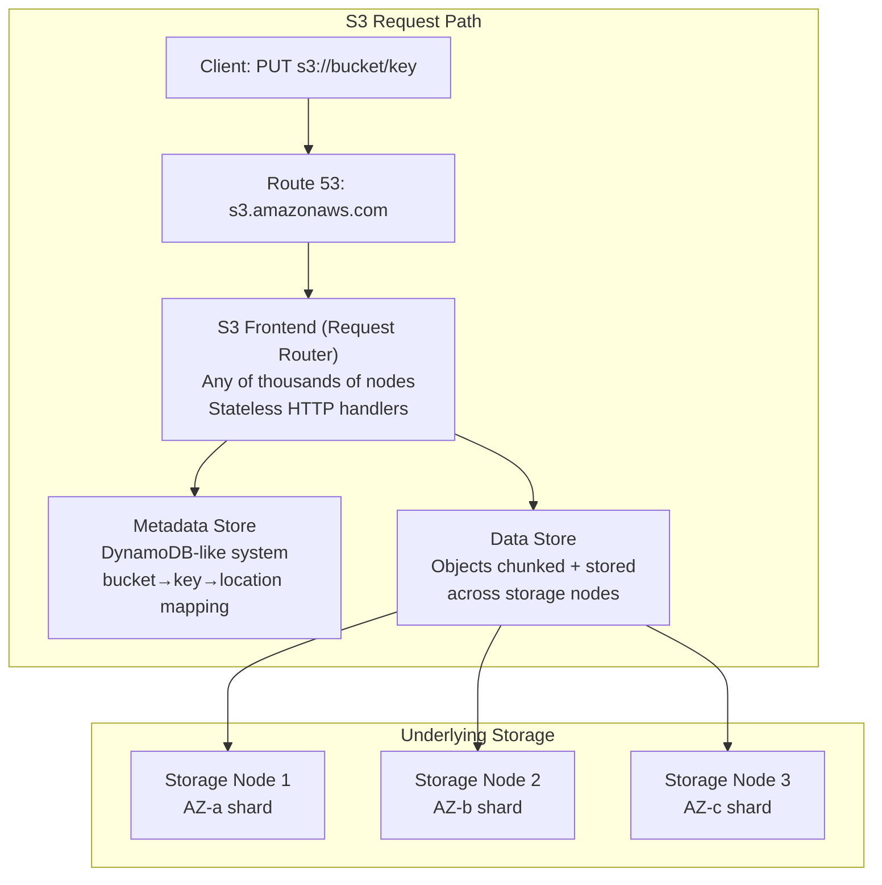
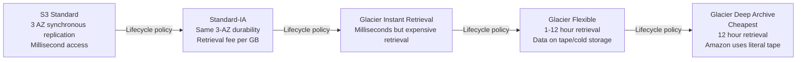
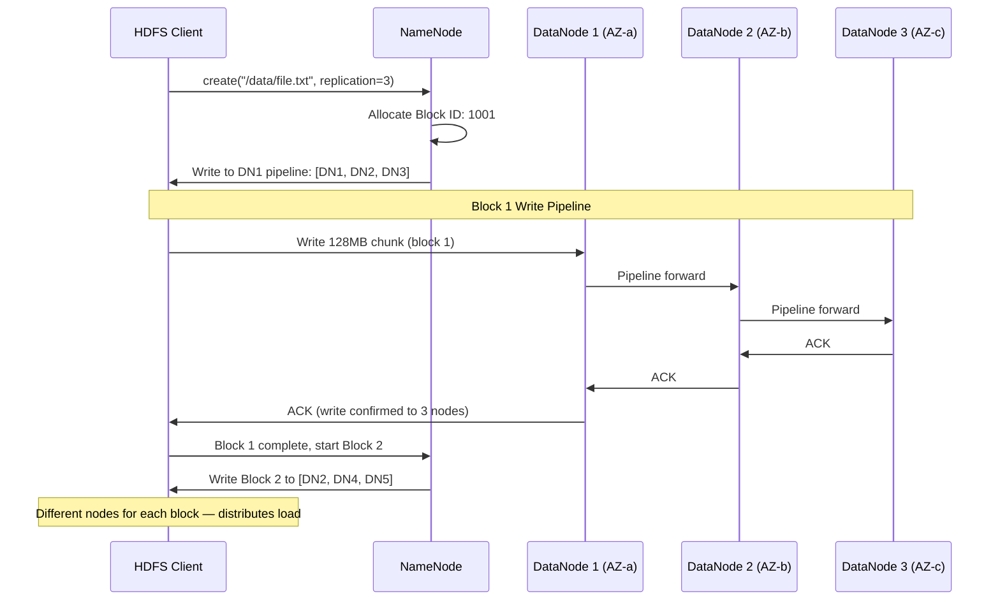
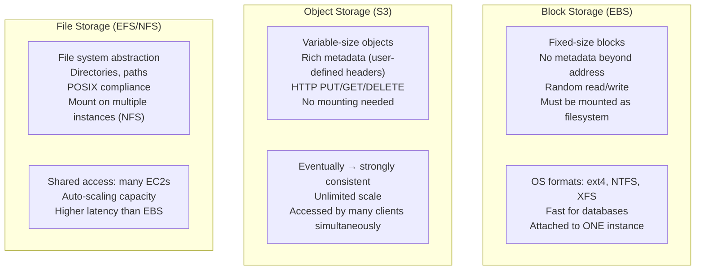
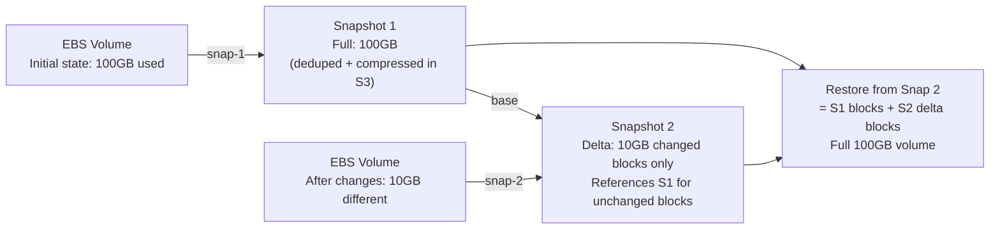

# D04 — Storage Internals
**Track: Deep Dive | How EBS, S3, and HDFS actually store your data**

---

## 1. EBS Architecture — Network Block Device Over NVMe

EBS is not a disk. It is a distributed storage system that presents itself to your EC2 instance as a local NVMe block device.



### EBS Write Path



**Why EBS is slower than local SSD:** The round trip includes: Nitro card serialization + storage network traversal + EBS node processing + replication + ACK back. Total: ~0.5–2ms for gp3, vs ~0.05ms for local NVMe (i3 instances).

### EBS Volume Types

| Type | Media | Max IOPS | Max Throughput | Latency | Use Case |
|------|-------|---------|----------------|---------|----------|
| gp3 | SSD | 16,000 | 1,000 MB/s | ~1ms | Default, general use |
| gp2 | SSD | 16,000 | 250 MB/s | ~1ms | Legacy general use |
| io2 Block Express | SSD | 256,000 | 4,000 MB/s | <0.5ms | Critical DBs, SAP HANA |
| st1 | HDD | 500 | 500 MB/s | ~10ms | Throughput: big data |
| sc1 | HDD | 250 | 250 MB/s | ~10ms | Cold data, cheapest |

---

## 2. S3 Architecture — How Objects Are Actually Stored

S3 is not a file system. It is a **key-value object store** built on AWS's distributed infrastructure.



### S3 Consistency Model

Pre-2020: S3 was **eventually consistent** for overwrite PUTs and DELETEs. You could read stale data after an update.

Post-2020: S3 is **strongly consistent** (read-after-write) for all operations. After a successful PUT, any GET returns the new object immediately.

**How strong consistency is achieved:** S3 uses a distributed metadata system that tracks object versions with strict serialization. Every write goes through a single metadata writer for that object's partition. Reads consult this metadata to find the latest version. This is expensive to implement at S3 scale — it took AWS years to achieve.

### S3 Durability — 11 Nines

```
How 99.999999999% durability is achieved:

1. Object uploaded to S3 frontend
2. Frontend routes to primary data node
3. Primary node writes to 3+ storage nodes synchronously
4. Each storage node is on different physical hardware, different rack, different AZ
5. Background scrubbing: periodic checksums verify data integrity
6. Background replication: if a node fails, S3 automatically re-replicates to maintain redundancy

To lose data: Need simultaneous failure of ALL copies + erasure coding segments
Probability: ~1 in 10^11 per object per year
```

### S3 Storage Classes — Internal Implementation



---

## 3. HDFS Write Path — How Hadoop Stores Your 1TB File



**NameNode single point of failure:** The NameNode holds ALL metadata in RAM. Loss = cluster death. Mitigations:
- SecondaryNameNode: Periodic checkpoint (not HA — you lose recent changes)
- HA NameNode: Two NameNodes with ZooKeeper-based failover (production standard)

### HDFS Block Placement Strategy

```
Default placement rule (rack-aware):
Block 1 replica 1 → Local rack DataNode (write speed)
Block 1 replica 2 → Different rack DataNode (rack failure tolerance)
Block 1 replica 3 → Same different rack (throughput + redundancy)

Why? Two replicas on same rack = lost to single rack switch failure.
Two replicas on different racks = two network hops for writes, but survives rack failure.
```

---

## 4. Object Storage vs Block Storage vs File Storage



| Criteria | Block (EBS) | Object (S3) | File (EFS) |
|----------|------------|-------------|-----------|
| Access method | Mounted block device | HTTP REST API | NFS mount |
| Random I/O | Excellent | Not supported | Good |
| Multiple writers | No (one EC2) | Yes | Yes |
| Max size | 64 TB per volume | Unlimited | Unlimited |
| Latency | ~1ms | ~10–100ms | ~5ms |
| Best for | Databases, OS | Images, backups, logs | Shared app data |

---

## 5. EBS Snapshot Internals

EBS Snapshots are not full copies — they are **incremental block-level snapshots** stored in S3.



**Why deleting snapshots is safe:** AWS tracks reference counts. If you delete Snap 1 but Snap 2 references its blocks, those blocks are not deleted. Data moves to Snap 2. The EBS snapshot system handles this automatically.

---

## 6. Storage Failure Scenarios

| Scenario | EBS Behavior | S3 Behavior | HDFS Behavior |
|----------|-------------|-------------|---------------|
| Single disk fails | Replica serves I/O, background re-replication | Replica serves, background re-replication | DataNode reported dead to NameNode, NN triggers re-replication |
| AZ power outage | Volume unavailable (if single-AZ). io2 Multi-Attach = still available | No impact (cross-AZ replicated) | Block replicas in surviving AZs still accessible |
| Data corruption | Checksums detected, replica promoted | Background scrubbing detects, re-replicates | Checksums on every block, re-replication on mismatch |
| NameNode failure (HDFS) | N/A | N/A | Cluster down until NN restored (without HA) |
