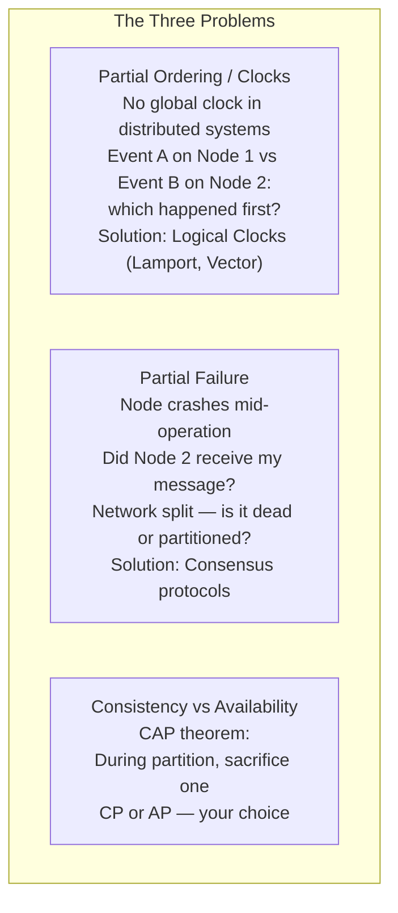
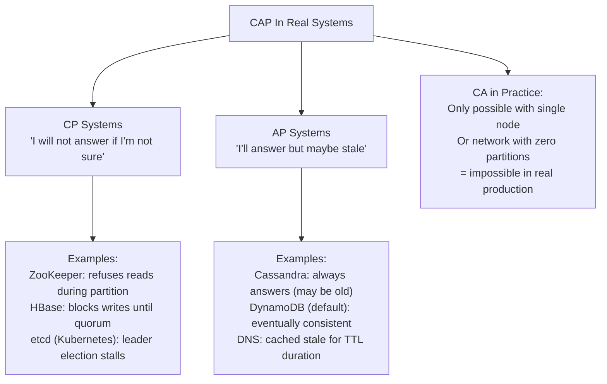
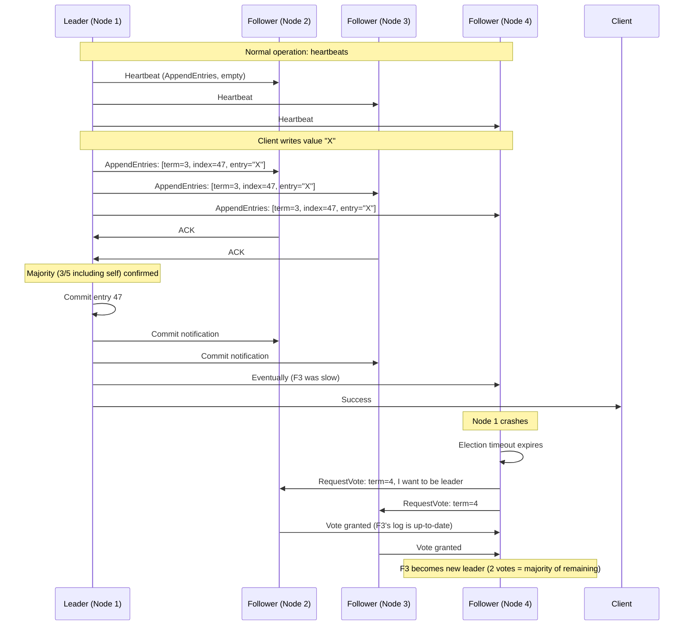
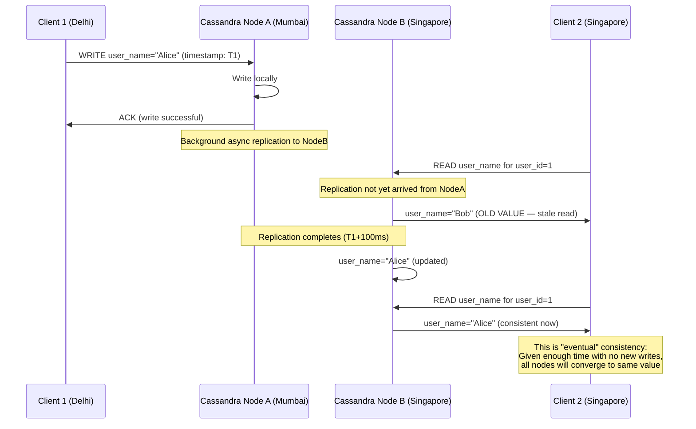
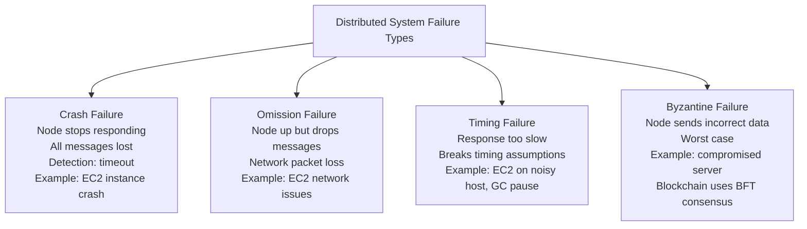

# D05 — Distributed Systems Internals
**Track: Deep Dive | Consensus, CAP in practice, failure detection**

---

## 1. Why Distributed Systems Are Hard

Three fundamental problems that don't exist on a single machine:

---

## 2. The CAP Theorem — Real Implementation Choices

**Practical design choice:** For banking (financial consistency critical): CP. For e-commerce shopping cart (slight inconsistency acceptable): AP. For DNS (stale for TTL is fine): AP. For distributed locks: CP (must be consistent, can sacrifice availability).

---

## 3. Consensus — How Distributed Nodes Agree

**Problem:** 5 nodes need to agree on a value (e.g., "is Node 3 the leader?"). Any node could be slow, crashed, or on the wrong side of a network partition.

### Raft Consensus Algorithm

Raft is the consensus algorithm used by etcd (Kubernetes control plane), Consul, CockroachDB.

**Quorum:** With N nodes, Raft requires (N/2 + 1) nodes to confirm writes. With 5 nodes, 3 must confirm. This tolerates 2 simultaneous failures. With 3 nodes, 2 must confirm — tolerates 1 failure.

---

## 4. Eventual Consistency — What It Actually Means

---

## 5. Distributed System Failure Modes

