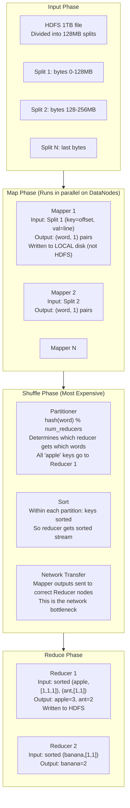
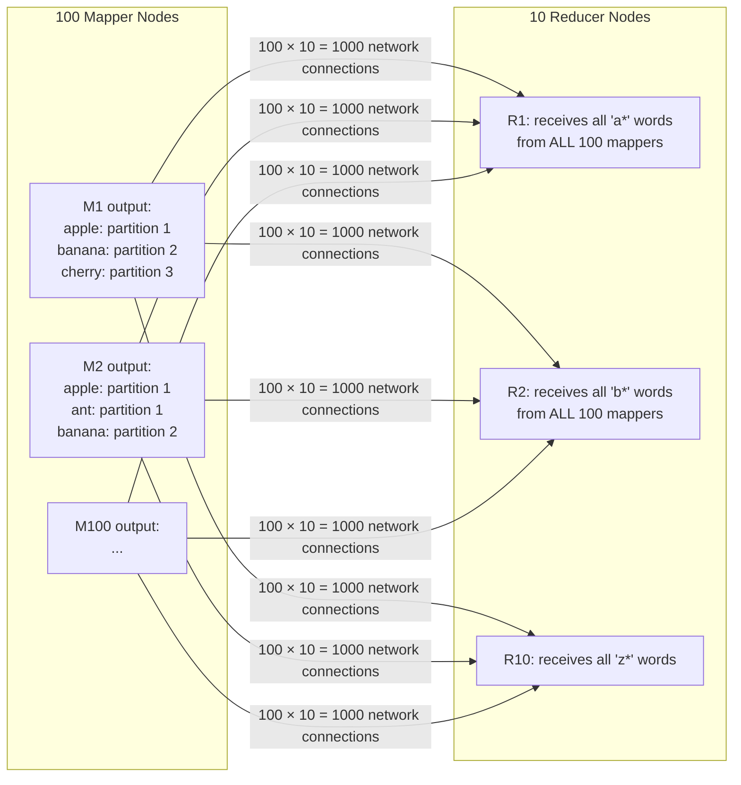
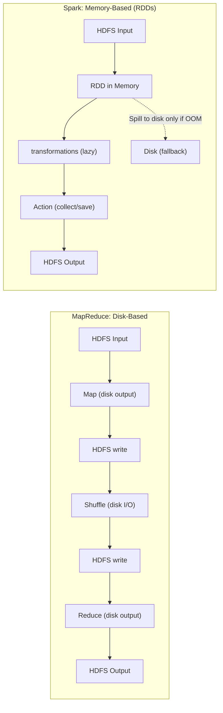
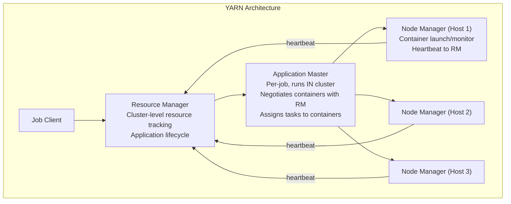

# D06 — MapReduce Internals
**Track: Deep Dive | Scheduler, shuffle, sort, and why Spark replaced it**

---

## 1. MapReduce Execution Phases — Detailed

---

## 2. The Shuffle — Why It's the Bottleneck

The shuffle is the most expensive phase in MapReduce:

1. Every Mapper writes output to local disk (not HDFS — local disk is faster)
2. Partitioner decides: for each (key, value) pair, which Reducer should handle this?
3. The framework moves data from every Mapper node to every Reducer node over the network
4. At scale (1000 mappers × 100 reducers = 100,000 network connections)

**Why shuffle bottlenecks:** Network I/O at scale. 100 mappers × 10GB each = 1TB transferred. 10 reducers each receive 100GB from 100 sources. This requires careful bandwidth management.

---

## 3. MapReduce vs Spark — The Internal Difference

**For iterative algorithms (ML training):** MapReduce reads from HDFS every iteration. Spark caches the dataset in memory — only one HDFS read for all iterations. 10 iterations = 10x disk I/O for MR vs 1x for Spark.

**Spark fault tolerance:** If an RDD partition is lost (node crash), Spark recomputes it from its lineage (knows all transformations applied to input). No need to store every intermediate result.

---

## 4. YARN — Resource Management

YARN (Yet Another Resource Negotiator) separates resource management from computation.

**Why YARN matters:** Before YARN, Hadoop's JobTracker did resource management AND job scheduling — a bottleneck. YARN separates these. A YARN cluster can run MapReduce, Spark, Flink, and other frameworks simultaneously.