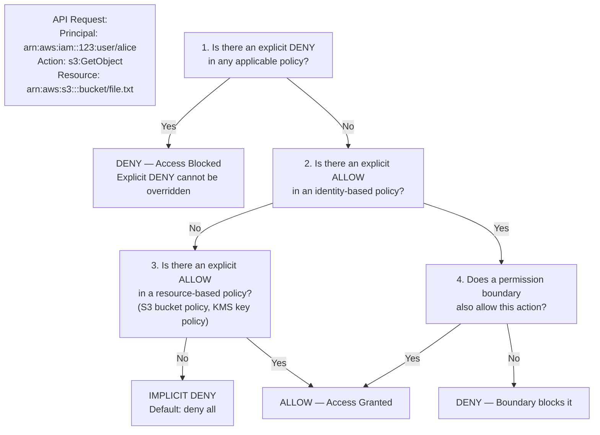
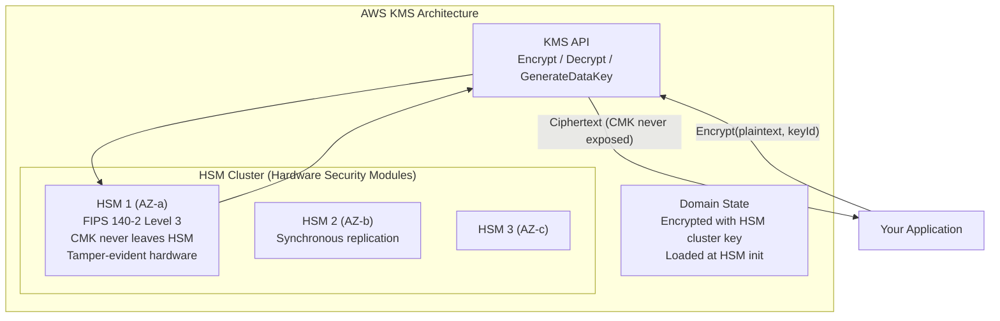
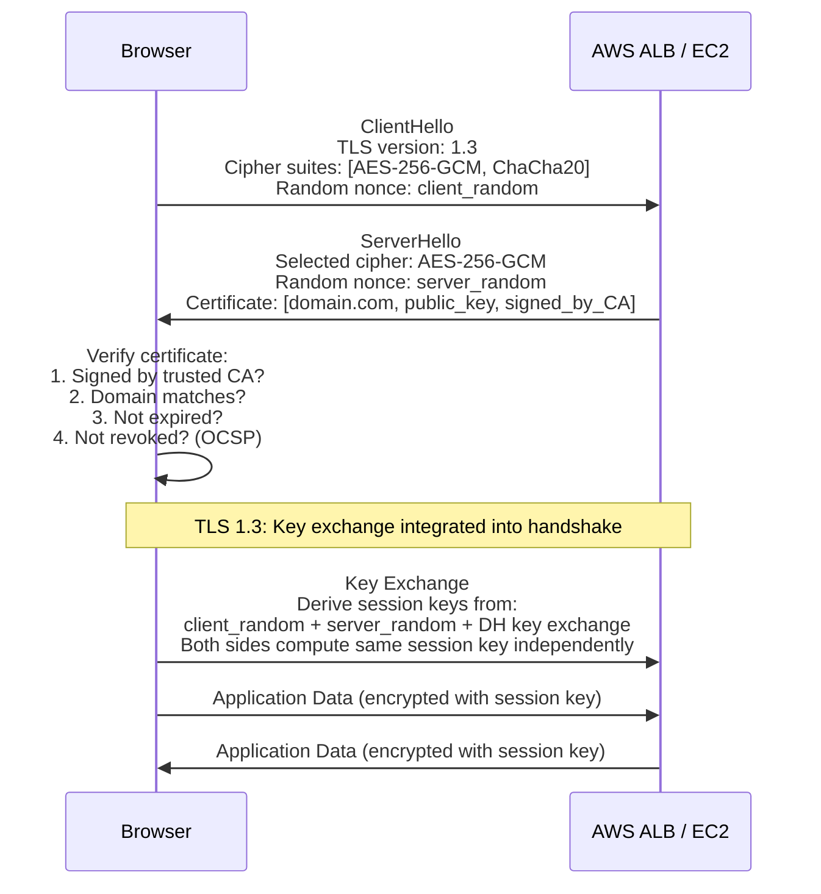
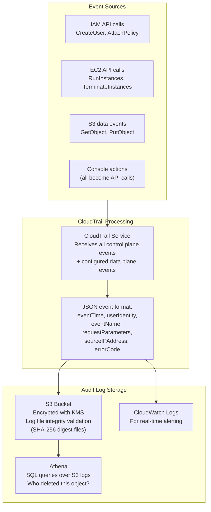

# D07 — Security Internals
**Track: Deep Dive | IAM evaluation engine, KMS, TLS handshake**

---

## 1. IAM Policy Evaluation Engine — Complete Logic



**Policy types evaluated (in order):**
1. SCP (Service Control Policy) — AWS Organizations limit
2. Permission Boundary — limits max permissions for IAM entity
3. Session Policy — temporary credentials scope
4. Identity Policy — user/role/group policies
5. Resource Policy — S3 bucket policy, KMS key policy

---

## 2. AWS KMS — How Encryption Keys Are Protected



**Envelope encryption (how S3 SSE-KMS works):**

```
1. S3 calls KMS: GenerateDataKey(CMK_id)
2. KMS returns: (plaintext_data_key, encrypted_data_key)
   - plaintext_data_key: random 256-bit AES key in memory
   - encrypted_data_key: plaintext_data_key encrypted with your CMK (stored in S3 metadata)
3. S3 encrypts the object with plaintext_data_key (fast AES encryption)
4. S3 discards plaintext_data_key from memory
5. Stores encrypted_data_key alongside the object

To decrypt:
1. S3 retrieves encrypted_data_key from metadata
2. S3 calls KMS: Decrypt(encrypted_data_key) — requires access to CMK
3. KMS returns plaintext_data_key (only if IAM allows)
4. S3 decrypts object, discards plaintext_data_key
```

**Why envelope encryption?** KMS only encrypts small payloads (up to 4KB). Encrypting a 5GB object directly in KMS is impossible and would be enormously expensive. The data key handles the bulk data; KMS only handles the small key.

---

## 3. TLS Handshake — What HTTPS Actually Does



**Perfect Forward Secrecy (TLS 1.3):** Each TLS session uses a new ephemeral Diffie-Hellman key pair. If the server's private key is compromised in the future, past sessions cannot be decrypted (the session key was never transmitted, only derived). This is why TLS 1.3 is mandatory for compliance-heavy workloads.

---

## 4. CloudTrail — Audit Architecture



**Log file integrity validation:** CloudTrail generates a SHA-256 digest file every hour referencing all log files delivered that hour. The digest file itself is signed with CloudTrail's private key. You can verify no log files were tampered with or deleted by checking the digest chain.

---

## 5. Security Failure Scenarios

| Scenario | Attack | What Happens | Mitigation |
|----------|--------|-------------|-----------|
| Access keys in GitHub | Attacker finds keys via automated scanning | Full API access within minutes | Use IAM roles, GitHub secret scanning |
| Overly permissive IAM | Compromised Lambda has s3:* | Can read/modify all buckets | Least privilege — specific ARN + specific actions |
| Public S3 bucket | Attacker finds bucket | Data breach, public read access | Block Public Access + S3 Access Analyzer |
| No MFA on root | Phishing attack | Total account takeover | MFA mandatory on root |
| CloudTrail disabled | Attacker disables logging | No forensic record | Alert on CloudTrail stop, SCPs preventing disable |
| Insecure user data | EC2 user data contains secrets | Instance metadata leaks secrets | Secrets Manager + IAM roles |
